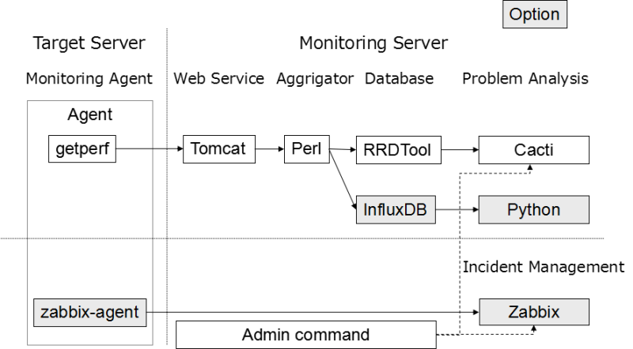

Getperf
=======

About Getperf
-------------

The Getperf is software that has the following features in the development framework of the system monitoring.

* In system monitoring operation, there are two approaches of incident management and problem analysis, and each provides a different solution.
* In the case of incident management, it need the initial failure handling and comprehensive management. Getperf use the [Zabbix](www.zabbix.com) as its solution.
* In the case of problem analysis, it need the escalation and analysis of the fault, Getperf use the [Cacti](http://www.cacti.net/).
* Thought system for monitoring operation has the following two aspects, using open source suitable for each and integrates system monitoring.

|              | Event monitoring (Zabbix)                | Trend monitoring (Cacti)                      |
| ------------ | ---------------------------------------- | --------------------------------------------- |
| Applications | 1st escalation in the case of fault      | Secondary analysis of failure                 |
|              | Focus on known problems (routine tasks)  | Focus on unknown problem (atypical work)      |
| Approach     | Alert e-mail notification                | Monitoring of graph                           |
|              | Exhaustive, comprehensive approach       | Heuristic, refinement after system is Go Live |
| Needs        | Need a firmly and robust mechanism       | Need a flexible mechanism                     |
|              | Need a Immediacy, reliability            | Need a ad-hoc analysis of large data          |

Configuration
-------

System configuration will be following.



* Getperf Agent
    - Data collection agent that was coded in C language.
    - It use Web Service [gSOAP](http://www.cs.fsu.edu/~engelen/soap.html).
    - Internal scheduler periodically run the command list, compressed execution result (collecting data) to zip, and forwards it to the Monitoring Server.
* Web Service
    - Data transfer web service that was coded in Java.
    - Web services will transfer the collected data from the Getperf Agent to the monitoring site.
* Data Aggrigatior
    - Data Aggrigaor that was coded in Perl script.
    - Script can be customized for each monitoring site, aggregation method in accordance with the operation, and then edit the definition of the metric.
    - Accumulation of aggregate data will use the [RRDTool](http://oss.oetiker.ch/rrdtool/) of time-series database. Use the [InfluxDB](https://influxdata.com/) for data analysis options.
* OSS Monitoring Frontend
    - On the front end of the graph monitoring use the [Cacti](http://www.cacti.net/).
    - Use the [Zabbix](http://www.zabbix.com/) in the event monitoring.
    - The management command to automate the setup of these M/W.

Install
=======

You wrote the installation instructions for CentOS 6.x environment. Please refer to the [installation](docs/en/sphinx-doc/03_Installation/index.rst).

Notes
-----

Installation of the server has a strong dependence in the root,　It could be adversely affected the existing environment. We strongly recommend the installation of a clear installation environment OS.

Preparation
-----------

* You will need an environment in which disabled the SELinux.
* In an intranet environment becomes necessary Proxy setting during the external connection with yum command.
* Installation user need to run sudo privileges.

Please refer to [preparation](docs/en/sphinx-doc/03_Installation/01_Preparation.rst).

Package Installation
---------------

Install the basic package.

```
sudo -E yum -y groupinstall "Development Tools"
sudo -E yum -y install kernel-devel kernel-headers
sudo -E yum -y install libssh2-devel expat expat-devel libxml2-devel
sudo -E yum -y install perl-XML-Parser perl-XML-Simple perl-Crypt-SSLeay perl-Net-SSH2
sudo -E yum -y update
```

Download the Getperf module ※ provisional public version.

```
git clone https://github.com/getperf/getperf
cd getperf
```

Install the Perl with cpanm.

```
source script/profile.sh
echo source $GETPERF_HOME/script/profile.sh >> ~/.bash_profile
sudo -E yum -y install perl-devel
curl -L http://cpanmin.us | perl - --sudo App::cpanminus
cd $GETPERF_HOME
sudo -E cpanm --installdeps .
```

Server Installation
-----------

To complete the installation by using software configuration management tool [Rex](http://www.rexify.org/).

Create a configuration file.

```
cd $GETPERF_HOME
perl script/cre_config.pl
```

Create the SSH key for local access of Git repositories

```
rex install_ssh_key
rex create_ca                   # Creating root certificate authority
rex create_inter_ca             # Creating intermediate certificate authority
rex server_cert                 # Server certificate creation
sudo rex run_client_cert_update # Periodic update of the client certificate
```

Install the Web Service.

```
sudo -E rex install_package   # Package install
sudo -E rex install_sumupctl  # Regist Aggrigation daemon startup
rex prepare_apache            # Install Apache HTTP server
sudo -E rex prepare_tomcat    # Install Apache Tomcat
rex prepare_tomcat_lib        # Install Tomcat lib
rex prepare_ws                # Install Web Service
sudo -E rex svc_auto          # Regist startup script
rex svc_start                 # startup services
```

Set the MySQL and Cacti.

```
rex prepare_mysql     # Regist MySQL root password
rex prepare_composer  # Install PHP lib
rex prepare_cacti     # Install Cacti
```

Install the Zabbix.

```
sudo -E rex prepare_zabbix
```

Agent compile
-------------

Compile the agent source in the monitoring server CentOS.
Create the download for the Web page, Eegister the source module of the agent.

```
cd $GETPERF_HOME
sudo -E rex prepare_agent_download_site
rex make_agent_src
```

In a Web browser, Download the source module "getperf-2.x-Buildx-source.zip"
Compile to extract the source module

```
cd /tmp
wget http://{Server address}/docs/agent/getperf-2.x-Build8-source.zip
unzip getperf-2.x-Build*-source.zip
cd getperf-agent
./configure
make
```

Install the agent

```
perl deploy.pl
```

"getperf-zabbix-Build?-CentOS6-x86_64.tar.gz" is the archive of the distribution module of the agent.
Other platforms compile, such as Windows, please refer to [compile on each platform](docs/en/sphinx-doc/03_Installation/10_AgentCompile.rst).

How to use
==========

Site initialization
-------------------

To build the site under the specified directory. Here you create a site called 'site1'.

```
cd (Some directory)
initsite site1
```

It will output the message such as Site key, access key, and Cacti site URL. Site key, access key use in the setup of the agent. So please make a note. Go to open the URL and Cacti site. And log in as admin/admin.

Startup aggrigation script.

```
cd (Some directory)/site1
sumup start
```

Agent Setup
-----------

Here are the set-up procedure of the Linux environment. For Windows, please refer to the [Windows monitoring](docs/en/sphinx-doc/04_Tutorial/03_WindowsResourceMonitoring.rst).
Go to the ptune/bin of the installed agent, and run the setup.

```
cd $HOME/ptune/bin
./getperfctl setup
```

You will need to enter the access key that was issued by the site initialization at the time of the agent authentication. After the agent authentication, and an update of the SSL certificate.
Once the setup is complete, start the agent.

```
./getperfctl start
```

Run the Zabbix agent configuration file creation script.

```
cd $HOME/ptune
./script/zabbix/update_config.sh
./bin/zabbixagent start
```

Create the automatic startup script to /etc/init.d/.

```
cd $HOME/ptune/bin
sudo perl install.pl --all
```

Cacti Graph registration
------------------

Go to the site directory.
That the graphs registration of the agent that was set up by using the cacti-cli command.

```
cd (some directory)/site1
cacti-cli node/Linux/{agent name}/
```

Make a chart registration on the basis of the definition files that are generated under the node directory.
After the execution, and access to the Cacti site, make sure that the resource graph, such as CPU utilization rate of the target agent has been created.
Customizing the graph layout, please refer to the [Cacti graph registration](docs/en/sphinx-doc/07_CactiGraphRegistration/index.rst).

Zabbix monitoring registration
------------------------------

Regist the host of Zabbix. Edit the .hosts files under the site directory in the beginning, and set the IP address of the agent.

```
echo "{IP} {host}" >> .hosts
```

Regist the Zabbix host by using the zabbix-cli command.

```
zabbix-cli --add node/Linux/{host}
```

Refference
===========

1. [gSOAP](http://www.cs.fsu.edu/~engelen/soap.html)
2. [Apache Axis2/Java](http://axis.apache.org/axis2/java/core/index.html)
3. [Rex](http://www.rexify.org/)
4. [RRDTool](http://oss.oetiker.ch/rrdtool/)
5. [Cacti](http://www.cacti.net/)
6. [Zabbix](http://www.zabbix.com)

AUTHOR
======

Minoru Furusawa <minoru.furusawa@toshiba.co.jp>

COPYRIGHT
=========

Copyright 2014-2016, Minoru Furusawa, Toshiba corporation.

LICENSE
=======

This program is released under [GNU General Public License, version 2](http://www.gnu.org/licenses/gpl-2.0.html).
