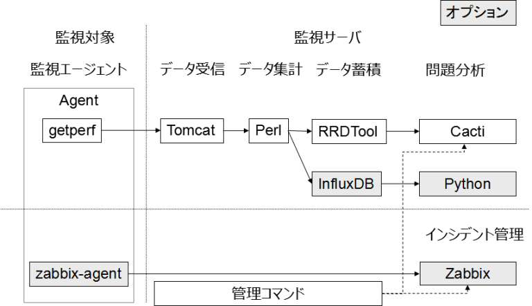

システム概要
============

システム構成は以下の通りです。マスクのかかった箇所はオプションで設定ファイルにより、インストールの有無を指定できます。

監視エージェント
----------------

オープンソースの監視ソフト Zabbix のエージェントと、自製の Getperf エージェントをパッケージ化したモジュールを配置します。
自製の Getperf エージェントは以下の特長があります。

-  C言語でコーディングされたデータ収集エージェントです。
-  シングルバイナリのマルチスレッド構成で動作し、フットプリントが小さい特長があります。
-  監視サーバとの通信インターフェースに
   `gSOAP <http://www.cs.fsu.edu/~engelen/soap.html>`_ を使用します。
-  内部スケジューラによりコマンドを定期実行し、実行結果(採取データ)を
   zip に圧縮し、監視サーバに転送します。
-  シンプルで、直感的な動作となるよう設計しています。

データ受信
----------

Java でコーディングされた、データ受信 Webサービスです。

-  監視エージェントからの収集データを集計側の監視サイトに転送します。
-  Webサービスに
   `Axis2 <http://axis.apache.org/axis2/java/core/>`_　を使用します。
-  HTTP　サーバに Apache HTTP Server,Web コンテナに Tomcat を使用します。

データ集計
----------

Perlを使用した集計モジュールで以下の特長があります。

-  Perl
   のオブジェクトコンテナ `Object-Container <http://search.cpan.org/dist/Object-Container/>`_ を使用して少ないコードで集計処理を記述できます。
-  Gitによる変更管理をサポートします。
-  複数の監視サイトを管理するマルチサイト機能をサポートします。
-  Zabbix, Cacti
   の監視設定コマンドと監視定義ファイルを用いてコマンドベースでの監視設定作業をサポートします。

データ蓄積
----------

集計データの蓄積は時系列データベースの
`RRDtool <http://oss.oetiker.ch/rrdtool/>`_ を使用します。オプションで
`InfluxDB <https://influxdata.com/>`_ を追加できます。
InfluxDB　を追加した場合は、RRDtool のデータ蓄積に加え、InfluxDB にも同じ定義のデータが蓄積されます

問題分析/障害対応
-----------------

-  問題分析の監視に `Cacti <http://www.cacti.net/>`_ を使用します。
-  インシデント管理に統合監視ソフト `Zabbix <http://www.zabbix.com/>`_
   を使用します。
-  各ソフトの監視設定コマンドを用いてこれらソフトの設定を自動化します。

