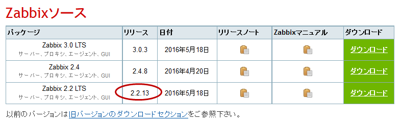

Zabbixインストール
==================

getperf\_zabbix.json 設定ファイルの編集
---------------------------------------

オープンソースの統合監視ソフト Zabbix のインストールをします。
はじめに、getperf_zabbix.json 設定ファイルを編集します。

::

    cd $GETPERF_HOME
    vi config/getperf_zabbix.json

各設定項目を以下に記します。

-  ZABBIX_SERVER_VERSION

   Zabbix の LTS(Long Term Support)　バージョンである 2.2 系を指定します。既定は、2.2.10 となりますが、マイナーリリースの更新がある場合は上位のバージョンを指定します。バージョンの確認は、以下開発サイトURLのZabbixソースのリストで確認してください。

   http://www.zabbix.com/jp/download.php (Zabbixソースセクション)

-  ZABBIX_AGENT_VERSION

   エージェントは 上記 URL のコンパイル済みZabbixエージェントダウンロードからコンパイル済みバイナリをダウンロードします。ダウンロードリストに記載されているバージョンを指定してください。

-  DOWNLOAD_AGENT_PLATFORMS

   Zabbix エージェントは各プラットフォームのバイナリをダウンロードしてインストールします。予め監視対象のプラットフォームのリストを記載します。プラットフォーム名は、`コンパイル済みZabbixエージェント <http://www.zabbix.com/jp/download.php>`_ からダウンロードファイルを選択し、ダウンロードファイル名のリリースバージョンの後ろのサフィックス名を記します。例えば、zabbix_agents_2.2.9.linux2_6.i386.tar.gzは、linux2_6.i386 がプラットフォーム名となります。

-  ZABBIX_ADMIN_PASSWORD

   Zabbix Web コンソールの管理者ユーザのパスワードを記述します。セキュリティの観点から既定値を変更してください。

-  USE_ZABBIX_MULTI_SIZE

   複数の監視サイトを構成し、それぞれの監視サイト毎に Zabbix の監視設定を変えたい場合は   1にしてください。複数の監視サイト構成でも、Zabbix インスタンスは　1つとなりますが、1にした場合、インスタンス内で各監視サイト別にグループ、監視テンプレート、監視アイテムを分けて設定をします。

-  GETPERF_AGENT_USE_ZABBIX

   Zabbix を無効にしたい場合は 0 にしてください。

Zabbix インストール
-------------------

Zabbix サーバ一式のインストールと、エージェント一式のダウンロードをします。Zabbix サーバは開発元が提供するyumリポジトリからインストールをします。

::

    sudo -E rex prepare_zabbix

エージェントは、設定ファイルに指定したプラットフォームのバイナリを{GETPERF_HOME}/module/getperf-agent/var/zabbix
の下にダウンロードします。各ダウンロードファイルのMD5　チェックサム結果がインストールメッセージに出力されるので、上述の開発元ダウンロードサイトのURL の MD5 記述と同じであることを確認してください。

.. note::

  -  MySQL データベース作成エラーについて

     yum でインストールされた、Zabbix サーバと、getperf_zabbix.json で記載したバージョンが異なる場合に MySQL
     データベースの作成に失敗する場合が有ります。その場合は以下のインストールディレクトリからバージョンの確認をします。

     ::

         ls /usr/share/doc/| grep zabbix
         zabbix-2.2.10
         zabbix-server-mysql-2.2.10

     getperf_zabbix.json の ZABBIX_SERVER_VERSION　に正しいバージョンを指定してください。以下例では2.2.10を指定します。     設定後、以下のコマンドを手動で作成中のデータベース (zabbix)を削除し、インストールスクリプトを再実行することで、データベースの再作成を行います。

     ::

         mysqladmin -u root -p drop zabbix
         sudo script/deploy-zabbix.pl

     mysql　の root パスワードは config/getperf_site.json の GETPERF_CACTI_MYSQL_ROOT_PASSWD となります。

Zabbix の動作確認
-----------------

インストールが成功すると、 Zabbix サーバプロセスが自動起動されます。以下の確認をします。

-  'ps -ef | grep zabbix_server' を実行してプロセスの起動を確認します
-  'tail -f /var/log/zabbix/zabbix_server.log' を実行してログを確認します
-  Webブラウザから 'http://{監視サーバアドレス}/zabbix/' を開いて管理コンソールログイン画面を確認します
-  管理コンソールログイン画面から、ユーザ admin、パスワードは ZABBIX_ADMIN_PASSWORD　を入力してログインします

これで Zabbix のインストール作業は完了です。この後の Zabbix の監視設定は、管理コマンド zabbix-cli
を用いて行います。詳細は、 :doc:`../08_ZabbixRegistration/index` を参照してください。

この後の作業について
--------------------

以上でベースとなる監視サーバのインストール作業は完了です。この後の作業は以下となり、1 はオプションで必要な場合のみインストールしてください。2 は監視対象となるエージェント側のインストールの事前作業となります。

1. 時系列データベース InfluxDB のインストール(オプション)
2. エージェントのコンパイル
