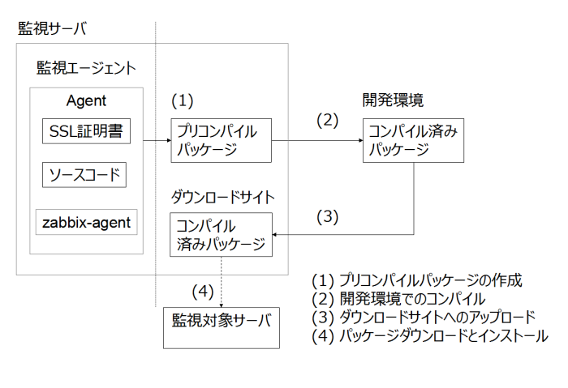

エージェントコンパイル
======================

Getperf エージェントは C 言語でコーディングされたバイナリモジュールで、複数台の監視対象サーバでのインストールを想定しています。監視対象での作業を効率化するために以下のアプローチをとっています。

1. 開発環境での事前作業

   監視対象のライブラリ構成に合わせたモジュールを準備します。開発環境などでの監視対象プラットフォームでモジュールをコンパイル／パッケージングします。

2. 本番機インストール作業

   パッケージングしたエージェントモジュールをインストールする作業。監視対象での作業は、パッケージのダウンロード、解凍、最小限の動作確認のみとしています。

2の作業の効率化を図るため、1の事前の準備作業の負荷が高くなっています。そのフローを下図に記します。

   エージェントインストール手順

1. プリコンパイルパッケージの作成

   監視サーバのSSL証明書、Getperf エージェントソース、各プラットフォームの Zabbix エージェントのバイナリをまとめたしたアーカイブを作成します。

2. 開発環境でのコンパイル

   Linux, Windows など各プラットフォーム上で、1で作成したアーカイブをダウンロードしてコンパイルを行います。各プラットフォームで
   C コンパイラが必要となります。

3. ダウンロードサイトへのアップロード

   コンパイルしたバイナリをパッケージングして、監視サーバにアップロードします。

4. パッケージダウンロードとインストール

   コンパイル済みパッケージをダウンロードしてインストールをします。

1から3までが事前準備作業となり、4 は監視対象側でのインストール作業となります。

事前準備
--------

エージェントダウンロードサイト作成
^^^^^^^^^^^^^^^^^^^^^^^^^^^^^^^^^^

ダウンロード用 Web ページを設定します。

::

    cd $GETPERF_HOME
    sudo -E rex prepare_agent_download_site

プリコンパイルパッケージ作成
^^^^^^^^^^^^^^^^^^^^^^^^^^^^

エージェントのプリコンパイルモジュールを作成します。

::

    rex make_agent_src

これは、Webサービス用 SSL　証明書、エージェントソースコード、Zabbix エージェントをパッケージングしたモジュールとなります。 Web ブラウザで
http://{サーバアドレス}/docs/agent/
を開いてください。リストの中の getperf-2.x-BuildX-source.zip がプリコンパイルパッケージとなります。

.. note::

    * 403 Forbidden エラーについて

      Webブラウザを開くと 'You don't have permission to access'というエラーが出る場合があります。 
      Getperf 管理ユーザのホームディレクトリの権限の問題の可能性がありますので、その場合は、以下でホームディレクトリに参照権限を付加してみてください。

      ::

        chmod a+rx　~/

各プラットフォームでのコンパイル
--------------------------------

Linux環境でのコンパイル
^^^^^^^^^^^^^^^^^^^^^^^

プリコンパイルパッケージをダウンロードしてコンパイルします。~/work/srcディレクトリを作業ディレクトリとした場合の例を以下に記します。

::

    mkdir -p ~/work/agent/src
    cd ~/work/agent/src
    wget http://{サーバアドレス}/docs/agent/getperf-2.x-Build5-source.zip

ソースモジュールを解凍します。

::

    unzip getperf-2.x-Build5-source.zip

Linux ディストリビューションのヘッダファイルを作成します。実行後、Linux のディストリビューション情報が記録されたinclude/gpf_common_linux.h　ヘッダファイルが生成されます。

::

    cd getperf-agent
    perl make_header.pl

ソースをコンパイルします。

.. .. note::

..   OpenSSL 1.1.x の互換性の問題で configure に失敗するため
..   configure.ac の以下の箇所をコメントアウト

..   ::

..      vi configure.ac

..      #AC_CHECK_LIB([crypto], [SSL_library_init], [],
..      #       [AC_MSG_FAILURE([OpenSSL not found, see http://www.openssl.org/])])

..   configure を再作成

..   ::

..      autoheader 
..      aclocal 
..      automake --add-missing --copy 
..      autoconf 

::

    ./configure
    make

deploy.pl スクリプトを用いて、コンパイル済みパッケージとしてパッケージングします。

::

    perl deploy.pl

パッケージの出力先を適切なディレクトリに指定してください。既定はホームディレクトリとなります。SSL証明書、WebサービスURLは既定のままでエンターキーを入力します。実行すると、指定ディレクトリ下に以下のディレクトリ、ファイルが生成されます。

::

    ptune                             # エージェントホームディレクトリ
    getperf-zabbix-Buildx-xxx-xxx.tar.gz   # エージェントホームのアーカイブ
    upload_var_module.zip             # エージェントホーム、アップデートモジュールのアーカイブ

.. note::

   下記の not found エラーが出た場合、ガイド目次:インストール＞Zabbixインストール にて保存したモジュール名を、エラーメッセージの内容に合わせてリネームしてください。 

   not found : '/home/psadmin/work/agent/src/getperf-agent/var/zabbix/zabbix_agents_6.0.17.linux2_6.amd64.tar.gz' at deploy.pl line 338.

upload_var_module.zip　が、ダウンロードサイト用にファイル一式をアーカイブしたファイルとなり、監視サーバにアップロードします。

::

    cd {パッケージの出力先}
    scp upload_var_module.zip {管理ユーザ}@{監視サーバアドレス}:/tmp/

監視サーバ側で以下の手順でダウンロードサイトのホームディレクトリに解凍してください。

::

    cd $GETPERF_HOME/var/docs/agent/
    unzip /tmp/upload_var_module.zip

Windows環境でのコンパイル
^^^^^^^^^^^^^^^^^^^^^^^^^

事前準備
~~~~~~~~

**VisualStudio C コンパイラのインストール**

Visual C++ を用いてコンパイルします。コンパイラ環境がない場合は、Microsoft 社の
`Visual Studio Express <https://www.visualstudio.com/downloads/>`_ のダウンロードサイトからインストールしてください。
使用するライブラリは全てエージェントソースの win32  の下にあるのでパッケージの追加は必要です。
使用ライブラリは以下の通りです。

  -  zlib1.2.8
  -  OpenSSL 1.0.0e

**Zlib**

http://www.zlib.net/ を開きます。

'zlib compiled DLL' を検索し、コンパイル済み DLL の zip アーカイブをダウンロードします

::

  mkdir /tmp/zlib
  cd /tmp/zlib
  wget http://zlib.net/zlib128-dll.zip
  unzip zlib128-dll.zip

DLLを $WIN32_HOME/bin にコピーします。

::

  export WIN32_HOME=$GETPERF_HOME/module/getperf-agent/win32
  mkdir $WIN32_HOME/bin/
  cp zlib1.dll $WIN32_HOME/bin/

include と lib ディレクトリを $WIN32_HOME/zlib　にコピーします。

::

  mkdir $WIN32_HOME/zlib/
  cp -r include lib $WIN32_HOME/zlib/

**OpenSSL**

'Shining Light Productions' からインストーラをダウンロードします。

::

  http://slproweb.com/products/Win32OpenSSL.html

'Win32 OpenSSL v1.0.2g' (Recommended for software developers) を検索します。
Win32 OpenSSL　インストーラをダウンロードします。

インストーラをダウンロードして、'C:\OpenSSL-Win32' に解凍します。
'Copy OpenSSL DLLs to:' は 'The OpenSSL binaries' を選択します。
OpenSSL-Win32 ディレクトリにアーカイブし、監視サーバの /tmp/OpenSSL-Win32.zip にコピーします。

::

  cd /tmp
  unzip ~/OpenSSL-Win32.zip

DLL を $WIN32_HOME/bin にコピーします。

::

  cd OpenSSL-Win32/bin
  cp msvcr120.dll libeay32.dll ssleay32.dll $WIN32_HOME/bin/

include と lib を $WIN32_HOME/ssl にコピーします。

::

  cd ../include
  mkdir -p $WIN32_HOME/ssl/include/
  cp -r openssl $WIN32_HOME/ssl/include/
  cd ../lib
  mkdir $WIN32_HOME/ssl/lib/
  cp libeay32.lib ssleay32.lib $WIN32_HOME/ssl/lib/

プリコンパイルパッケージ作成
~~~~~~~~~~~~~~~~~~~~~~~~~~~~
上記Zlib、OpenSSLを梱包したエージェントソースパッケージを作成します。

::

  cd $GETPERF_HOME
  rex make_agent_src

以降はエージェントコンパイルステップになります。

Perl のインストール
~~~~~~~~~~~~~~~~~~~

コンパイル済みパッケージの作成作業で Perl を使用します。`ActivePerl開発サイト <http://www.activestate.com/>`_ から、Windows用Perl の最新版をダウンロードしてインストールしてください。

7zip のインストール
~~~~~~~~~~~~~~~~~~~

また、パッケージの圧縮作業で7zip を使用します。 `7zip 開発サイト <https://sevenzip.osdn.jp/download.html>`_ からダウンロードしてインストールしてください。

コンパイル
~~~~~~~~~~

スタートメニューからVisualStudio のコマンドプロンプト(Developper Command Prompt)を選択して、コマンドプロンプトを起動します。これは、nmake, cl などコンパイラツールのパスが環境変数に設定されたコマンドプロンプトになります。
c:を作業ディレクトリとして作成し、その下でコンパイルをする想定で手順を記します。

::

    mkdir c:\work
    cd c:\work

プリコンパイルパッケージのダウンロードと解凍をします。Web ブラウザからhttp://{監視サーバアドレス/download を開き、プリコンパイルパッケージgetperf-2.x-Build5-source.zip をc:にダウンロードします。ファイル解凍ツールなどを用いて、解凍します。

::

    c:\work>cd getperf-agent
    c:\work\getperf-agent> nmake /f Makefile.win

コンパイル済みパッケージとしてパッケージングします。

::

    c:\work\getperf> perl deploy.pl

作成されたファイルは Linux と同様で、upload_var_module.zip を監視サーバにアップロードし、監視サーバの $GETPERF_HOME/var/agent/ の下に解凍します。

UNIX環境でのコンパイル
----------------------

基本は Linux のコンパイル手順と同じとなります。注意点を以下に記します。

-  UTF-8 BOM付のソースコードのコンパイルエラーについて

   Linux と同様に gcc コンパイラを使用しますが、gcc のバージョンが古い場合に ソースコードの UTF-8 BOM   の解析エラーが発生する場合があります。その場合は nkf コマンドなどのコード変換ツールを用いて以下のように BOM
   を削除してください

::

    find -name '*.h' -o -name '*.c' | xargs nkf -w -Lu --overwrite

.. note::

    * SPARC Solarisの場合

      SPARC Solarisは、OS標準で /usr/sfw の下に gcc, OpenSSLライブラリを配布しています。
      以下の通り環境変数を設定して、 /usr/sfw のパスを通してコンパイルをします。

      ::

        export PATH=/usr/sfw/bin:$PATH
        export LD_LIBRARY_PATH=/usr/sfw/bin:$LD_LIBRARY_PATH

