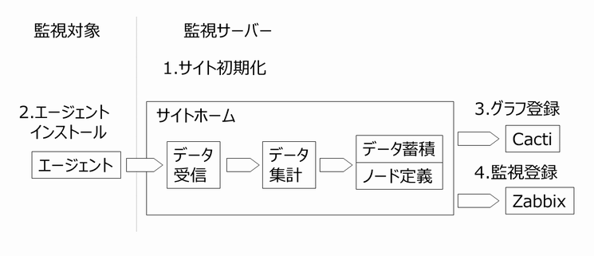

監視サイトの初期化
==================

前章のインストールした監視サーバとエージェントのインストールパッケージを用いて監視サイトの構築を行います。手順は以下となります。

1. サイト初期化

   監視サーバに監視サイトの登録をします。指定したディレクトリの下に、データ受信／集計／蓄積用、監視サイト定義用のディレクトリを作成します。サイト登録後、サイト集計デーモンを起動します。指定したディレクトリがサイトのホームディレクトリとなり、監視設定作業は本ディレクトリに移動してから行います。

2. エージェントインストール

   エージェントのパッケージインストールをします。パッケージを解凍後、1で作成したサイトのサイトキーを指定して監視サーバとのHTTPS通信設定を行います。通信設定後、エージェントを起動します。監視サーバ側はエージェントからのデータを受信し、サイト集計デーモンが定義した集計ルールに従ってデータ集計をします。Zabbix オプションを指定した場合は合わせてZabbixエージェントもインストールします。

3. Cacti グラフ登録

   エージェントからのデータ集計処理が実行されると、グラフ監視用の時系列データと、ノード定義が生成されます。ノード定義は監視対象のメトリック情報(プロセッサのモデルなど)をまとめた定義ファイルです。生成された時系列データと、ノード定義を基に
   Cacti 監視ソフトにグラフ登録します。グラフ登録は Cacti
   管理コマンドを用います。

4. Zabbix 監視登録

   3と同様の手順でZabbix 用管理コマンドを用いて Zabbix に監視対象ホスト／アイテムを登録します。

サイトの初期化
--------------

.. note::

    * Getperf 管理用ユーザ以外のユーザでサイトを初期化する場合

      Getperf 管理用ユーザと異なる OS
      ユーザで実行する場合は以下で環境変数を設定してください。

      ::

          source (GETPERFホームディレクトリ)/script/profile.sh
          echo source $GETPERF_HOME/script/profile.sh >> ~/.bash_profile

サイト初期化コマンド initsite を用いて、指定したディレクトリの下にサイトを構築します。 ここでは例としてホームディレクトリの ~/work の下に、'site1' というサイトを作成します。

::

    mkdir ~/work
    cd ~/work
    initsite site1

サイト作成処理のログが出力され、'Welcome to Getperf monitoring site
!'と出力されれば成功です。以下の項目のログはエージェントのセットアップで使用しますので、メモしておいてください。

::

    The site key is "XXX" .
    The access key is "XXX" .

サイトキーはサイトを一意に決めるキー情報です。 initsite  で指定したサイトディレクトリパスの最下位のディレクトリ名となります。
アクセスキーはエージェントがサイトにアクセスする際のパスワードとなります。

.. note::

    * アクセスキーを確認するには

      サイトディレクトリに移動して以下のコマンドを実行してください。

      ::

            cd (サイトホームディレクトリ)
            sumup --info

ログメッセージ内のURLを開くとCactiサイトにアクセスできるか確認します。CactiサイトURLは、http://{監視サーバ}/{サイトキー}となります。

::

    http://{監視サーバ}/site1

admin/admin でログインします。

.. note::

    * git cloneによる開発サイトの複製について

      ログメッセージ内で git clone　で始まるコマンドは別サーバにサイトホームを複製するコマンドで開発用、テスト用のサイトとして別環境で動作確認をするときに使用します。詳細は、 `Gitによるサイト複製 <../10_Miscellaneous/05_SiteCloning.html>`_ を参照してください。

サイト集計デーモンの起動
------------------------

サイトの管理コマンドを sumup
を使用して、サイトデータ集計用のデーモンプロセスを起動します。サイト内の管理コマンドは、サイトホームディレクトリに移動して実行します。以下のコマンドでデーモンを起動します。

::

    cd site1
    sumup start

sumup [start\|stop\|restart\|status]
でデーモンプロセスの起動、停止、再起動、状態確認ができます。以下コマンドでデーモンの起動を確認してください。

::

    sumup status
    ps -ef | grep sumup

以上でサイト初期化は完了です。この後のエージェントインストールで、作成したサイトのサイトキーとアクセスキーを指定することにより、採取データの送信を開始します。
