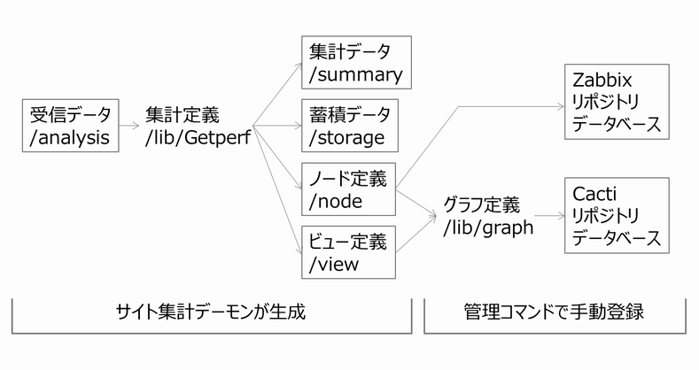

監視サーバの設定
================

エージェントを起動すると監視サーバのサイトディレクトリ下でデータを受信し集計処理を行います。そのフローは以下となります(図内の/analysis,/lib/Getperf などはサイトディレクトリ下のディレクトリとなります)。

   サイトデータフロー

* サイト集計デーモンによるデータ集計

   Webサービスがエージェントからのデータを受信し、サイト集計デーモンが受信したデータの集計を行います。集計処理は Perl スクリプトでサイト毎のカスタマイズを前提としています。Perl スクリプトは受信データを集計して、時期系列データベースにロードします。ここでは、時系列データベースを蓄積データと呼びます。また、受信データから付帯情報を抽出して、ノード定義を登録します。
   ノード定義の例として、監視対象が CentOS でエージェントから `/proc/cpuinfo <https://www.centos.org/docs/5/html/5.1/Deployment_Guide/s2-proc-cpuinfo.html>`_ の結果を受信した場合、集計スクリプトは CPU 構成情報(プロセッサモデルなど)を抽出し、ノード定義に登録します。ビュー定義はノードリストでノードの配置順や絞り込みをする場合に使用します。

* 管理コマンドでの手動登録

   集計定義で集計されたノード定義、ビュー定義をもとに、管理コマンドを用いて各監視ソフトに登録をします。管理コマンドは使用するオープンソース監視ソフトごとに専用のコマンドを用意しています。Cacti 用管理コマンドは、監視画面のレイアウトやグラフ構成を定義した、グラフ定義ファイルを読み込みグラフ登録をします。

サイト集計データの確認
----------------------

エージェントを起動すると、監視サーバ側でサイト集計デーモンが自動的にデータ集計を行います。データ集計の詳細は、後述の `データ集計カスタマイズ <../06_CustomizeDataCollection/01_GettingStarted.html>`_ で説明します。ここではサイト集計デーモンがどのような流れで処理しているかを実際のデータを確認しながら見ていきます。

**受信データ**

ここでは、監視対象が Linux の場合の受信データを集計例を記します。サイトホームに移動して各データファイルを確認します。

::

    cd ~/work/site1

エージェントは採取コマンド実行時の日付、時刻をディレクトリを作成し、同ディレクトリの下に結果を保存します。コマンド終了後、ディレクトリを zip 圧縮して監視サーバに転送します。監視サーバはzipファイルを受信後、analysis/{監視対象}/{ドメイン}の下に解凍します。

例 : Linux ドメインの受信データの確認

::

    ls analysis/{監視対象}/Linux/{日付}/{時刻}/

各ファイルが採取コマンドの実行結果となり、「{メトリック}.txt」 形式で保存されます。「stat_Linux.log」 はエージェント本体の実行ログで各採取コマンドの終了コード、エラーを記録したファイルとなります。

**集計定義**

集計定義は　Perl　スクリプトで lib/Getperf/Command/Site/{ドメイン}/{メトリック}.pm に配置します。各受信データのファイル名とスクリプトは1対1の構成となります。集計スクリプトが以降の集計データ、蓄積データ、ノード定義、ビュー定義の登録をします。

例 : Linux ドメインの集計定義

::

    ls lib/Getperf/Command/Site/Linux/

**集計データ**

集計スクリプトは受信データの各メトリック毎に処理します。各ファイルの集計スクリプトの実行結果は、summary ディレクトリの下に保存されます。

例 : Linux ドメインの集計データの確認

::

    ls summary/{監視対象}/Linux/{日付}/{時刻}/

各ファイルが集計データで、スペース区切りで時系列データを記述したファイルとなります。

device ディレクトリはディスク、ネットワークなどデバイス毎の集計データを保存します。ファイル名にデバイス名を追加し、"{メトリック名}__{デバイス名}.txt"の形式となります。

例 : Linux ドメインデバイスの集計データの確認

::

    ls summary/{監視対象}/Linux/{日付}/{時刻}/device/

**蓄積データ**

各集計データは時系列データベースの RRDtool のデータファイルにロードされます。各メトリック、デバイスごとに蓄積データファイルを保存します。

例 : Linux ドメインの蓄積データの確認

::

    ls storage/Linux/{監視対象}/

rrdtoolコマンドでデータの参照、登録、スキーマの管理をします。'rrdtool info {データファイル名}' とすることで、データファイルの定義情報を確認することができます。

例 : Linux ドメインのRRDtool の情報確認

::

    rrdtool info storage/Linux/{監視対象}/loadavg.rrd | grep ds

**ノード定義**

ノード定義は各メトリックの定義情報で node の下に保存されます。ファイルは JSON 形式で記述しており、各メトリックの RRDtool データファイルのパスを記述しています。

例 : Linux ドメインのノード定義の確認

::

    ls node/Linux/{監視対象}/

node/{ドメイン}/{監視対象}/info の下のディレクトリはノードの付帯情報を記録したファイルとなり、JSON 形式で各情報を記録しています。

例 : Linux ドメインのノード定義の付帯情報の確認

::

    ls node/Linux/{監視対象}/info/

**ビュー定義**

ビューはドメインに属する監視対象ノードの一覧で、view/{ドメイン}/{監視対象}.json の形式で空のJSONファイルから構成します。

例 : Linux ドメインのビュー定義の確認

::

    ls view/_default/Linux/

Cacti グラフ登録
----------------

cacit-cli コマンドを用いて Cacti 監視サイトにグラフ登録をします。cacti-cli の詳細は `Cactiグラフ登録 <../07_CactiGraphRegistration/01_GettingStarted.html>`_ にて説明をします。ここでは前節のデータを基にグラフ登録をします。
グラフ登録はノード定義のパスを指定して行います。パスの指定はいくつかのパターンがあり、以下に実行例を記します。

**グラフ定義**

cacti-cli コマンドはグラフ定義ファイルを参照して、登録するグラフのレイアウトを設定します。グラフ定義は、lib/graph/{ドメイン}ディレクトリの下に、各メトリックごとに保存されており、グラフのタイトル、グラフメニューの配置、グラフの凡例などの定義が記録されています。本定義がグラフ登録のルール定義となります。

例 : Linux ドメインのグラフ定義

::

    ls lib/graph/Linux/

**グラフ登録**

個々のメトリックのグラフを登録する場合は、cacti-cli
の実行オプションにJSONファイルまでのパスを指定してください。

例 : Linux loadavg メトリックのグラフ登録

::

    cacti-cli node/Linux/{監視対象}/loadavg.json

監視対象の全てのメトリックのグラフ登録をする場合は、'node/{ドメイン}/{監視対象}' までのパスを指定してください。

例 : Linux 監視対象全メトリックのグラフ登録

::

    cacti-cli node/Linux/{監視対象}/

ドメインに属する全ての監視対象のグラフ登録をする場合は、'node/{ドメイン}'　までのパスを指定してください。

例 : Linux 全監視対象のグラフ登録

::

    cacti-cli node/Linux/

.. note::

    * 既存のグラフの上書き登録について

      登録するグラフが既に存在する場合は、cacti-cli　コマンドはグラフの更新をせずに登録をキャンセルします。強制的に更新をする場合は、--forceオプションを追加してください

**Cacti サイトの確認**

登録されたグラフは Web ブラウザから、以下の Cacti サイトのURL を開いて確認します。ログインは admin ユーザ、パスワードは admin でログインしてください。

::

    http://{監視サーバアドレス}/site1/

.. note::

    * Internet Explorer での画面レイアウト表示崩れについて

      Cacti-0.8.8cより上のバージョンではgraphsタブの画面で画面レイアウトが崩れて表示される問題があります。その場合は　
      `Cacti パッチ適用 <../10_Miscellaneous/07_CactiPatch.html>`_ を参考に、Cacti のパッチを適用してください。

Zabbix 監視登録
---------------

zabbix-cli コマンドを用いて Zabbix 監視サイトに監視対象の登録をします。cacti-cli と同様にノードのパスを指定します。

**監視対象のIPアドレス設定**

zabbix-cli は監視対象のIPアドレスをZabbixに登録します。DNSなどで監視対象の名前からIPアドレスを引き当てられない場合は、(サイトホーム)/.hosts ファイルに、IPアドレスの登録が必要となります。IP,監視対象名の順で.hostsファイルにIPアドレスを登録してください。

::

   vi .hosts

   XXX.XXX.XX.XX   {監視対象}

.. note::

   * 監視対象サーバ名の命名ルールについて

      .hosts に記述する監視対象名はノード定義パスの監視対象ディレクトリ名と同じにする必要があります。
      ノード定義パスの監視対象ディレクトリ名は実際のホスト名から以下の変換をしています。

      -  大文字は小文字に変換
      -  ドメインのサフィックス部分を取り除く(.your-company.co.jpなど)

**Zabbix 監視登録**

Zabbix の監視テンプレートを用いてZabbixの監視登録そします。
Zabbix 監視テンプレートの例として Linux の監視定義を確認します。

::

   more lib/zabbix/Linux.json

zabbix-cli [--add\|--rm\|--info] {ノード定義パス} コマンドを用いて Zabbix の登録をします。
以下のコマンドで Zabbix の登録内容の確認をします。

例 : Linux 監視対象 の Zabbix 登録情報の確認

::

   zabbix-cli --info ./node/Linux/{監視対象}/

--info オプションは Zabbix への登録はせずに、登録内容を出力します。実際の登録には以下コマンドを実行します。

例 : Linux 監視対象 の Zabbix 登録

::

   zabbix-cli --add ./node/Linux/{監視対象}/

cacti-cli と同様にドメインの指定の場合、ドメインに属するすべての監視対象を登録します。
詳細は `Zabbix監視登録 <../05_AdminCommand/03_ZabbixHostRegist.html>`_ にて説明します。

**Zabbix サイトの確認**

Web ブラウザから、以下のZabbix 監視サイトの URL を開いて監視項目を確認します。ログインは admin ユーザ、パスワードは $GETPERF_HOME/conf/getperf_zabbix.json に記したパスワードでログインしてください。

::

    http://{監視サーバアドレス}/zabbix

zabbix-cli コマンドはテンプレートに基づいた監視対象のホストとアイテムの設定のみになります。
テンプレートのカスタマイズや、トリガーの通知先は、手動で Web管理画面から行います。
