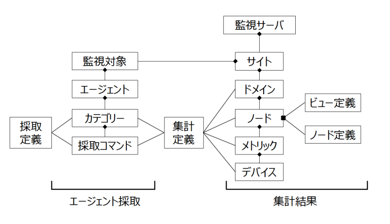

データ集計の流れ
================

エージェントからの採取コマンドデータを受信すると、監視サーバは予め定義した集計定義でデータ集計を行います。そのフローは以下の通りです。

   データ集計の流れ

* 採取コマンド

   エージェントで実行するコマンドリストとなります。エージェントは内部スケジューラがコマンドリストを定期実行し、実行結果を監視サーバに転送します。

* 集計定義

   エージェントからの受信データのファイル名から該当する集計スクリプトを検索します。検索されたスクリプトで、データの集計、時系列データベースへのロード、ノード定義、ビュー定義の更新をします。ノード定義、ビュー定義はCacti, Zabbix の設定で使用します。スクリプトは専用API :doc:`../../11_Appendix/02_AggregateScriptAPI` を用いてコーディングします。

集計モデル
==========

採取コマンド、集計定義の設定には以下の集計モデルの理解が必要となります。集計モデルとは、監視対象、監視項目の定義モデルで、本モデルをベースにデータ集計を行います。

   データ集計モデル

エージェント採取のデータモデル
------------------------------

監視対象で以下を定義します。:doc:`./02_CollectionCommand`　に従って定義します。

1. カテゴリー

   カテゴリーは内部スケジューラの実行グループ定義で、指定したインターバルでカテゴリーに属する採取コマンドを定期実行します。

2. 採取コマンド

   採取コマンドは以下の2パターンがあります。

   * ローカル採取

     vmstat などサーバ上の情報を採取する設定となります。
     コマンド名、実行引数、実行結果ファイルを登録します。実行するサーバが監視対象となります。

   * リモート採取

     SNMP や SQL などで外部の監視対象に対しての採取設定で、採取ファイル名に外部の監視対象を特定できるラベルを追加する必要が有ります。指定したラベルが監視対象となります。

集計結果のデータモデル
----------------------

集計デーモンはエージェントのカテゴリー名と採取コマンド名から該当する集計スクリプトを選択し、実行します。集計スクリプト内で以下のドメイン、ノード、メトリック、デバイスの各定義を登録します。

1. ドメイン

   集計データの括りでOS種類、ストレージ、ネットワーク、各種 M/W   のソフトウェア名をドメイン名として定義します。ローカル採取の場合、通常、ドメイン名はエージェントのカテゴリ名と同じになり、例えは、Linux, Windows 等になります。リモート採取の場合は監視対象の括りを定義します。例えば、仮想化環境で vCenter カテゴリの情報採取の場合、ドメイン名はクラスター、ホスト、VM、データストアに分類して定義します。

2. ノード

   監視対象の定義で、ローカル採取の場合は、エージェント実行サーバ名となります。リモート採取の場合は集計スクリプトで監視対象の名前を抽出します。採取コマンド実行結果から、またはコマンドの実行結果のファイルパス名から監視対象を抽出します。例えば、SNMP　でネットワーク機器をリモート採取する場合、ファイル名を　snmpget__{監視対象名}.txt などとし、ファイル名の後ろに監視対象名を付けます。集計スクリプトがファイル名を解析してノードを抽出します。

   .. note::

      ノードパスについて

      ノードは多階層のディレクトリ構成で定義することができます。例えば　/Tokyo/DB/host01 など、監視対象の地域や用途をディレクトリに追加することができます。ディレクトリ部分は node_path として定義します。

3. メトリック

   採取コマンドの集計結果の名前定義で、通常は採取コマンド実行結果のファイル名と同じにします。メトリックは複数の要素からなり、データベースのスキーマに似た定義となります。
   例として、Linux ドメインは、vmstat、iostat があります。

4. デバイス

   デバイスはディスクやネットワークなど複数の I/F からなるメトリックの追加定義となります。
   リスト形式でデバイス名を登録します。
   例として、iostat のデバイスは、sda、sdb などのストレージのデバイス名となります。

5. ビュー定義

   監視対象のノードの並び順やフィルタリングをする場合にビューを定義します。
   デフォルトのビューは '_default' で全てのノードが監視対象の登録順に定義されます。

6. ノード定義

   監視対象の付属情報の定義となります。
   例えば、OSのバージョン名や、プロセッサのモデル、クロック数などを登録します。
   また、各メトリックの rrd ファイルのパスは、ノード定義ファイル内で定義します。
