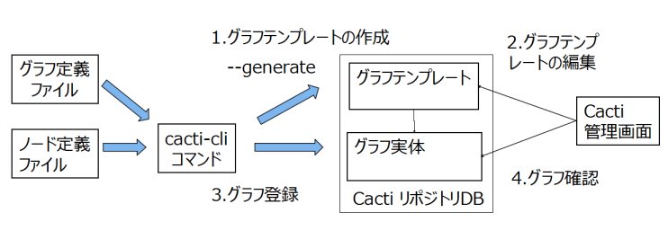
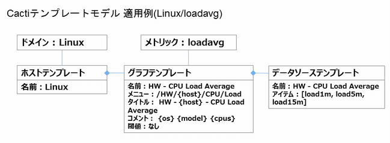

はじめに
========

この章では可視化ツール Cacti　のグラフ登録手順を記します。前提として既にデータ集計が行われ、ノード定義ファイルが生成されたものとして説明をします。
グラフ登録の手順は以下となります。

1. Cacti テンプレートの作成

  グラフ定義ファイルを基にグラフレイアウトのひな形を作成します。
  Cacti のホストテンプレート、グラフテンプレート、データソーステンプレートを作成します。
  これらテンプレートは監視対象ノードのグラフを登録する際のひな形として使用します。

2. 作成したテンプレートの編集

  CactiのWeb管理コンソールから作成したグラフテンプレートの修正をします。グラフのサイズ、配色、スケールの自動調整オプションなどのプロパティを編集します。

3. Cacti グラフ登録

  グラフテンプレートを選択してグラフを登録します。

4. 登録されたグラフの確認

  グラフ登録結果を確認し、場合によりグラフ設定を修正します。

1,2　のテンプレート作成作業は初回のみ行い、その後の各監視対象のグラフ登録は作成したテンプレートをひな型として使用します。1と3の作業は　**cacti-cli**　コマンドを使用します。
2と4の作業はWebブラウザからCacti管理コンソールで行います。

Linux, Windows, UNIX　の基本リソースのグラフテンプレートはサイト初期化時にデフォルトで Cacti リポジトリ DB にインストールされるため、新たにテンプレートを作成する必要はありません。

グラフ定義ファイル構成
----------------------

**cacit-cli**　コマンドはサイトのホームディレクトリ下で実行し、サイトホームディレクトリ下の以下のファイルを使用します。

1. lib/graph/{ドメイン名}/{メトリック名}.json

  グラフ定義ファイル。グラフテンプレート、グラフ実体の作成ルールを定義したファイルとなり、1つのメトリックに対して1つの定義ファイルが存在します。

2. lib/graph/color/default.json

  グラフの配色リストファイル。グラフテンプレート作成時の凡例の配色リストとなります。デフォルトは default.json となり、cacti-cli --color-scheme={配色リスト名} オプションで、別名の　{配色リスト名}.json を指定することができます。

3. node/{ドメイン名}/{ノード名}/{メトリック名}.json

  ノード定義ファイル。監視対象ノードのメトリック定義ファイルとなり、エージェントからの採取データの集計が終了した時点で自動生成されます。グラフ登録の際は、 **cacti-cli** コマンドに本定義ファイルを指定します。

グラフ登録の際の定義ファイルの検索ルールは、ノード定義ファイルのパス名からドメイン名、メトリック名を抽出して、該当するグラフ定義ファイルを読み込みます。

グラフテンプレートの種類
--------------------------

グラフのレイアウトパターンは以下の3種類となり、何れかを選択します。これらはグラフ定義ファイルにルールとして記述します。

- シングル

  最も単純なレイアウトで、サーバのCPU使用率など、1つのメトリックに対して1つのグラフを作成する場合に使用します

- シングルデバイス

  ディスク、ネットワークなど1つのメトリックに対して複数のデバイスを持つ場合に使用します。各デバイスに対して1つのグラフを作成します

- マルチデバイス

  複数のメトリックやデバイスを1つのグラフに登録する場合に使用します。複数のデバイスを凡例として列挙し1つのグラフを作成します

Cactiリポジトリのデータモデル
-----------------------------

Cactiで管理しているグラフテンプレートのモデルは以下となります。

   Cacti Template

-  ホストテンプレート

  複数のグラフテンプレートの括りの定義となり、通常はドメイン名と同じ名前にします。デフォルトのホストテンプレートは Linux,Windows　で、サイト初期化時にインストールされています。

-  グラフテンプレート

  グラフレイアウトの定義でCactiのメニュー配置、グラフのサイズ、グラフのタイトル、凡例のコメント、閾値などのを定義します。1つのメトリックに対して複数のグラフテンプレートを定義できます。

-  データソーステンプレート

  グラフの凡例定義で、1つのグラフテンプレートに対して複数のデータソースが存在します。データソースは RRDtool のデータソース名と対になっています。

何れも **cacti-cli --generate={グラフ定義ファイル}**　コマンドで、指定したグラフ定義ファイルを指定して、グラフテンプレートを生成します。

