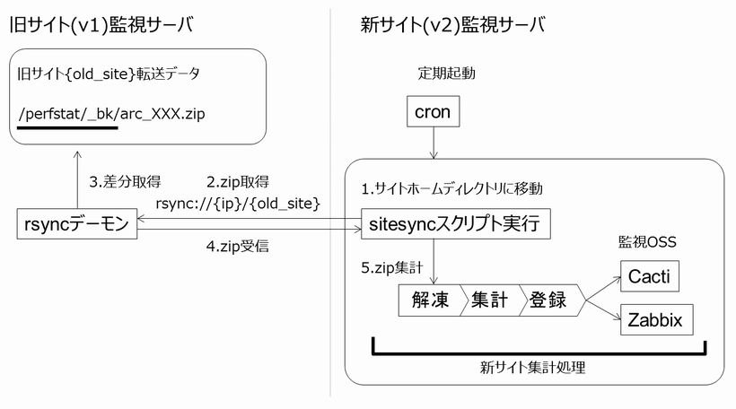

旧バージョン(v1)との連携
========================

機能概要
--------

Getperf は v2.5 は仕様変更により、旧バージョンである(～v2.4)とバージョンの互換性がありません。
旧サイトの移行策として、旧サイトのデータを新サイトにデータ転送（フォワード）する仕組みを用意しています。
機能構成は以下の通りです。
`rsync <https://rsync.samba.org/>`_ を用いて旧サイトのzip転送データを新サイトに同期を取る設定をします。
転送されたzipデータは指定したサイトホームディレクトリの下に解凍され、その後のデータ集計処理は新サイトのサイトホームの仕組みを利用します。
本仕組みはcronで定期実行します。

導入の際は事前に以下の設定が必要です。

-  旧監視サーバ側で、 rsync デーモンのインストールと、旧サイトのzip保存ディレクトリの rsync に設定
-  新監視サーバ側で、 rsync コマンドによる旧サイトデータの疎通確認と、 sitesync スクリプトの定期起動設定

.. note:: 新サイトが既にデータ集計されている場合の対処

   新監視サーバ側の集計はcronによる定期起動で、データ蓄積までの一連の処理を行います。
   既に集計デーモンを起動している場合は処理が二重で実行されるため、sumup stopで集計デーモンを停止してください。

旧監視サーバ側設定
------------------

はじめに
~~~~~~~~

ここでは、簡単にCentOS6の、yumによるrsyncインストール手順を記します。
基本的な設定のみなため、詳細の設定手順は開発元　`rsync <https://rsync.samba.org/>`_ ドキュメントなどで調べてください。

SE Linux の確認
~~~~~~~~~~~~~~~

SE Linux が有効になっている場合は、無効にしてください。

::

    sudo getenforce

Enforcing なら 有効。SE Linuxのrsync設定をするか、以下の通りSELinuxを無効にします。

::

    sudo setenforce 0

/etc/selinux/config を編集し、再起動の際も SELinuxの状態を無効にします。

::

    vi /etc/selinux/config

SELINUX の値を disabled に変更して保存します。

::

    SELINUX=disabled

rsync のインストール
~~~~~~~~~~~~~~~~~~~~

::

    sudo -E yum -y install rsync xinetd

xinetd 設定で、rsync を有効化します。

::

    sudo vi /etc/xinetd.d/rsync

disable = no に変更します。

xinetd の起動設定をします。

::

    sudo chkconfig xinetd on

rsync 設定
~~~~~~~~~~

旧サイトの転送データ保存ディレクトリの同期が取れる様に設定します。
rsyncd.conf ファイルを以下例の様に編集します。
ここでは、OS ユーザは pscommon、グループは cacti というユーザで、 old01 というサイトを同期する例を記します。

sudo vi /etc/rsyncd.conf

::

    # 名前(旧サイトのサイトキー)
    [archive_old01]
    # 転送データの保存ディレクトリ
    path =  /home/pscommon/perfstat/_bk
    # 転送先許可IPアドレス(新サーバから疎通できるようにする)
    hosts allow = 192.168.10.0/24
    hosts deny = *
    list = true
    # 転送データのオーナー
    uid = pscommon
    # 転送データのオーナーグループ
    gid = cacti
    read only = false 
    dont compress = *.gz *.tgz *.zip *.pdf *.sit *.sitx *.lzh *.bz2 *.jpg *.gif *.png

rsync 起動
~~~~~~~~~~

rsync 設定後、xinetd を再起動して、rsync デーモンを起動します。

::

    sudo /etc/rc.d/init.d/xinetd restart

新監視サーバ側設定
------------------

rsync疎通確認
~~~~~~~~~~~~~

新監視サーバ側で rsync の疎通確認をします。
旧監視サーバと同様に rsync のインストールをしてください。
インストール後、以下のコマンドを実行して疎通確認をしてください。
以下は、旧監視サーバの転送データを新監視サーバの/tmpディレクトリ下にコピーします。

::

   rsync -av --delete \
   rsync://{旧監視サーバアドレス}/archive_{サイトキー} \
   ./tmp

.. note:: 旧監視サーバ側でSELinuxが有効だと以下の権限エラーが発生します

   ::

       Oct  3 12:28:57 xxx rsyncd[4073]: rsync: chroot /home/pscommon/perfstat/_bk failed: Permission denied (13)

サイト同期スクリプト(sitesync)動作確認
~~~~~~~~~~~~~~~~~~~~~~~~~~~~~~~~~~~~~~

上記 rsync コマンドの疎通確認ができたら新監視サーバのサイトホームディレクトリで sitesync コマンド単体の動作確認をします。
以下は、上記、rsyncによるデータ同期後、移動したサイトホーム下のデータ集計、データ登録を行います。

::

    cd {サイトディレクトリ}
    ${GETPERF_HOME}/script/sitesync \
    rsync://{旧監視サーバアドレス}/archive_{サイトキー}

正しく実行すると、analysis 下に旧サイトの収集ファイルが保存されます。
この後のデータ集計以降の処理は従来と同じです。

::

    ls analysis/{旧サイトの監視対象}

.. note:: sitesync コマンドはサイトホームディレクトリに移動してから実行してください。

cronで定期起動
--------------

上記で、sitesyncスクリプトの同作確認ができたら、cron による定期起動の設定をします。

::

   0,5,10,15,20,25,30,35,40,45,50,55 * * * * (cd {サイトディレクトリ}; {GETPERFホームディレクトリ}/script/sitesync rsync://{旧監視サーバアドレス}/archive_{サイトキー} > /dev/null 2>&1) &

この後の作業は、従来通りのデータ集計とグラフ設定となります。

