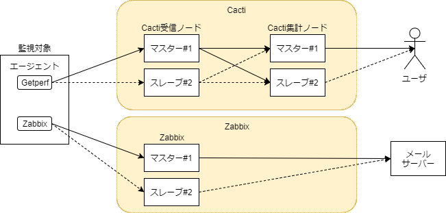
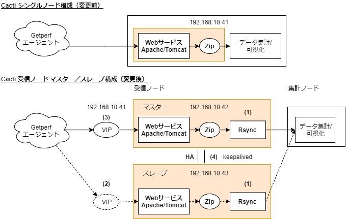
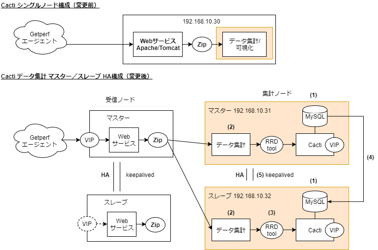
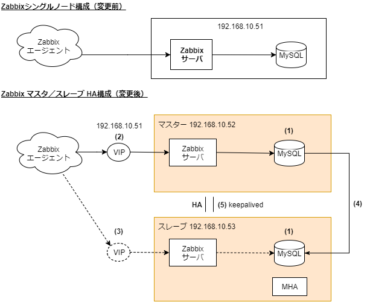

HA構成概要
----------

監視対象が数台規模の場合は、1台のシングルノードの監視サーバで運用は可能ですが、
監視対象サーバが数百台規模となり、
ミッションクリティカルな監視運用が必要となった場合、
監視サーバの冗長構成が必要となります。
本章では以下の監視要件を満たす、HA構成の監視サーバへの移行プラン、以降手順を記します。

* 数百~数千台の規模でも監視可能な構成にする
* 各機能のSPOFを排除し、冗長化構成にする
* 障害発生時に、自動リカバリができるようHA機能を追加する

以下、6台でHA構成を組みます。

* Cacti

   * Cacti機能を受信ノードと集計ノードに分離します
   * 受信ノードはGetperf 監視エージェントから性能データの受信を行います
   * 集計ノードは性能データの集計と Cacti グラフの可視化を行います
   * 集計ノードは用途に合わせて追加する
   * 受信ノードは確実に監視エージェントからの受信データを処理する

* Zabbix

Cacti受信ノードのHA化
^^^^^^^^^^^^^^^^^^^^^

Cacti受信ノードのHA化移行ポリシー
~~~~~~~~~~~~~~~~~~~~~~~~~~~~~~~~~

導入のステップは以下の通りです。

(1)RsyncでZibデータを送信できるようにする
~~~~~~~~~~~~~~~~~~~~~~~~~~~~~~~~~~~~~~~~~

マスタ／スレーブの各構成で、Rsyncによるデータ送信機能を追加します。
Webサービスで受信したZibファイルをRsync で後続の集計ノードに転送できる設定をします。

(2)スレーブノードWebサービスをVIPで受信できるようにする
~~~~~~~~~~~~~~~~~~~~~~~~~~~~~~~~~~~~~~~~~~~~~~~~~~~~~~~

WebサービスのApache の設定変更をし、VIPでスレーブノードが受信できるようます。
既設サーバの物理IPをVIPに変更します。

(3)マスターノードの既設IPをVIPに変更する
~~~~~~~~~~~~~~~~~~~~~~~~~~~~~~~~~~~~~~~~

ネットワーク構成の変更を行います。
マスターノードの既設IPを VIPに変更し、新規のIPを物理IPに変更します。

(4)keepalivedでVIPを冗長化する
~~~~~~~~~~~~~~~~~~~~~~~~~~~~~~

keepalivedを用いてマスターノード、スレーブノード間で VIP を冗長化します。
マスターノード障害発生時にスレーブノードに VIP の付け替えをします。

Cacti集計ノードのHA化
^^^^^^^^^^^^^^^^^^^^^

導入のステップは以下の通りです。

(1)Cacti MySQLリポジトリのバックアップ／リストア
~~~~~~~~~~~~~~~~~~~~~~~~~~~~~~~~~~~~~~~~~~~~~~~~

既設サーバのCacti用 MySQL リポジトリをバックアップし、スレーブノードでリストアします。

(2)受信ノードZipファイルからのデータ集計できるようにする
~~~~~~~~~~~~~~~~~~~~~~~~~~~~~~~~~~~~~~~~~~~~~~~~~~~~~~~~

受信ノードのZipファイルからデータ集計処理を行う設定をします。
Rsync 宛先を受信ノード Zip 保存先に設定し、Zip の取得、解凍、データ集計
の一連の処理を定期実行する設定をします。

(3)RRDtoolデータを同期する
~~~~~~~~~~~~~~~~~~~~~~~~~~

マスタノードからスレーブノードに RRDtool グラフデータのリストアをします。

(4)Cacti MySQLのレプリケーション設定
~~~~~~~~~~~~~~~~~~~~~~~~~~~~~~~~~~~~

マスターノードからスレーブノードへの MySQL レプリケーション設定をし、
Cactiリポジトリの同期設定をします。

(5)keepalivedでVIPを冗長化する
~~~~~~~~~~~~~~~~~~~~~~~~~~~~~~

keepalivedを用いてマスターノード、スレーブノード間で VIP を冗長化します。

Zabbix ノードのHA化
^^^^^^^^^^^^^^^^^^^

(1)Zabbix MySQLリポジトリのバックアップ／リストア
~~~~~~~~~~~~~~~~~~~~~~~~~~~~~~~~~~~~~~~~~~~~~~~~~

既設サーバのZabbix用 MySQL リポジトリをバックアップし、スレーブノードでリストアします。

(2)マスターノードの既設IPをVIPに変更する
~~~~~~~~~~~~~~~~~~~~~~~~~~~~~~~~~~~~~~~~

ネットワーク構成の変更を行います。
マスターノードの既設IPを VIPに変更し、新規のIPを物理IPに変更します。

(3)スレーブノード Zabbix をVIPで受信できるようにする
~~~~~~~~~~~~~~~~~~~~~~~~~~~~~~~~~~~~~~~~~~~~~~~~~~~~

WebサービスのApache の設定変更をし、VIPでスレーブノードが受信できるようます。
既設サーバの物理IPをVIPに変更します。

(4)Cacti MySQLのレプリケーション設定
~~~~~~~~~~~~~~~~~~~~~~~~~~~~~~~~~~~~

マスターノードからスレーブノードへの MySQL レプリケーション設定をし、
Zabbix リポジトリの同期設定をします。

(5)keepalivedでVIPを冗長化する
~~~~~~~~~~~~~~~~~~~~~~~~~~~~~~

keepalivedを用いてマスターノード、スレーブノード間で VIP を冗長化します。

(6)MHAでフェイルオーバー処理追加
~~~~~~~~~~~~~~~~~~~~~~~~~~~~~~~~

スレーブノードでMHAを設定し、マスターノード障害時に MySQL 、 Zabbix を
フェイルーバーする設定をします。
