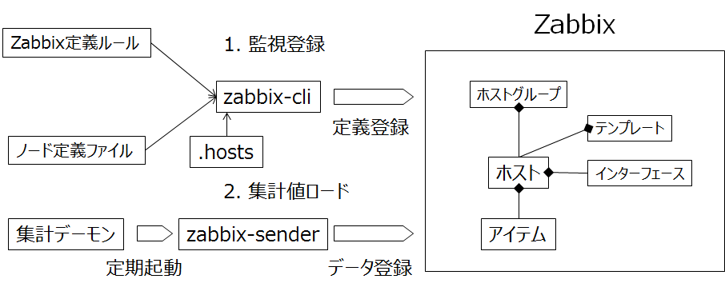

はじめに
========

Zabbix の監視登録手順、データ連携手順を説明します。そのフローは下図の通りです。

1. zabbix-cli コマンドによる監視登録

   Zabbix 登録コマンド **zabbix-cli** を使用して、Zabbixに以下の監視アイテムを登録します。

   * 監視対象ホスト、そのホストに属するホストグループ、テンプレート、インターフェース
   * 監視アイテム

2. 集計データのデータロード

   Getperf 集計スクリプトに Zabbix データロード用APIを追加し、集計スクリプト実行時に結果を Zabbix にロードします。Zabbix データロードコマンド zabbix_sender を定期起動します。

Zabbix エージェント/エージェントレス監視
----------------------------------

Zabbix との連携は以下の2つの方式があります。

1. Zabbixエージェント監視

   監視対象のZabbixエージェント側で情報採取をします。Getperfとの連携はZabbix 監視アイテムの登録のみでモニタリングは全てZabbixエージェント/サーバで行います。ログ監視やプロセスの死活監視の場合に使用します。

2. Zabbixエージェントレス監視

   Getperf で集計したデータを使用します。集計スクリプトに記述した Zabbix データ転送APIのコードに従い、Getperf が Zabbix に集計データをロードします。

事前準備
--------

* 事前に Zabbix サーバのインストールが必要です。インストール手順は、:doc:`../03_Installation/08_ZabbixInstallation` を参照してください。
* 監視対象で Zabbixエージェントが稼働している必要があります。ただし、エージェントレス監視のみを使用する場合は、Zabbix エージェントは不要です。
* Zabbixとの連携は監視アイテムの登録とデータロードのみで、Zabbix のトリガー、アクションなどその他の設定は、別途 Zabbix コンソールで行う必要が有ります。これら手順は、`Zabbixマニュアル <http://www.zabbix.com/documentation.php>`_ を参照してください。

ファイル構成
------------

**zabbix-cli**　コマンドはサイトのホームディレクトリ下で実行し、サイトホームディレクトリ下の以下のファイルを使用します。

Zabbix 定義ルール
~~~~~~~~~~~~~~~~~~

1. lib/zabbix/{ドメイン名}.json

   ドメイン定義ファイルでそのドメインに属するノードをZabbixのホストとして登録します。Zabbixのホスト、ホトグループ、テンプレートを定義します。

   例 : lib/zabbix/Linux.json

   ::

      {
          "is_physical_device" : 1,
          "host_groups" : ["Linux Servers"],
          "host_name" : "<node>",
          "host_visible_name" : "Linux - <node>",
          "templates" : [ "Template OS Linux" ]
      }

2. lib/zabbix/{ドメイン名}/{アイテム名}.json

   アイテム定義ファイルでZabbixのアイテムを定義します。

   例 : lib/zabbix/Linux/ora_alert_log.json

   ::

      [
        {
          "item_name": "adm.oracle.alert_log[<device.key>]",
          "type": "Zabbix agent",
          "key": "log[<device.value>]",
          "value_type": "log",
          "delay": 300
        }
      ]

ノード定義ファイル
~~~~~~~~~~~~~~~~~~

1. node/{ドメイン名}/{監視対象ノード}/info/{ノード付帯情報}.json

   監視対象ノードの付帯情報ファイルで定義されたアイテムをZabbixに登録します。

   例 : node/Linux/test_a1/info/oracle_log__orcl.json

   ::

      {
        "ora_alert_log" : {
          "orcl" : "/u01/app/oracle/diag/rdbms/orcl/orcl/trace/alert_orcl.log"
        }
      }

   この例は Oracle アラートログの定義で、記述内の　ora_alert_log がアイテムキーとなり、cacti-cli コマンドは"{アイテムキー}.json"をファイル名として、アイテム定義ファイル(前述のlib/zabbix/Linux/ora_alert_log.json)を参照します。

2. .hosts

   監視対象ノードとIPアドレスのリストでZabbixホストのインターフェースの登録で使用します。

   例 : .hosts

   ::

      192.168.0.1 server01
      192.168.0.2 server02
      192.168.0.3 server03

