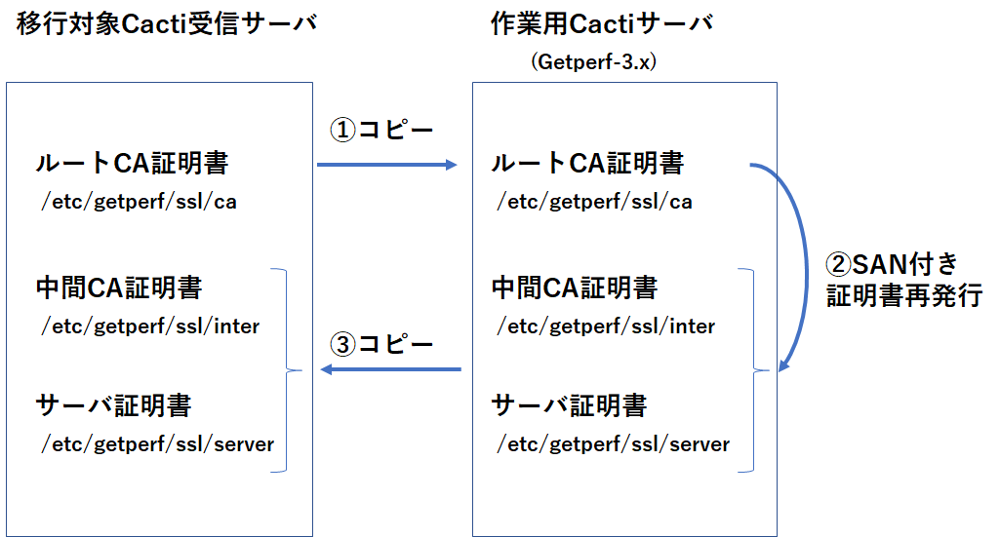

X.509 v3 版 SSL 証明書の再発行について
======================================

Getperf2.x のバージョンの SSL 証明書は、
X.509 v3 のサブジェクト代替名 Subject Alternative Name (SAN)に対応していません。
今後の脆弱性対策により、SAN のない SSL 証明書では、Cacti エージェント
とのHTTPS通信が出来なくなる予定です。

以下の Cacti エージェントバージョンから通信が出来なくなります。

    * Go 言語版 Cacti エージェント(getperf2) v2.19 以上
    * Oracle Linux 8 環境などの OpenSSL v 1.1 以降を使用した HTTPS 通信

    .. note::

        C 言語版 Cactiエージェントは古い OpenSSL v1.0 ライブラリをバンドル
        しているため、Oracle Linux 8 環境でも動作可能ですが脆弱性の観点から、
        古いOpenSSL ライブラリの利用を廃止するのが望ましい状況です。

対処として、X.509 v3 (SAN)に対応した、 SSL 証明の再発行を行います。
主な流れは以下の通りです。

作業用のGetperf-3.xがインストールされた Cacti サーバにで証明書の再発行をします。

    * ① 移行対象のルートCA証明書を作業用 Cacti にコピーします
    * ② コピーしたルート CA 証明書を基に、X.509 v3 (SAN) 版の証明書を再発行します
    * ③ 再発行した証明書を移行対象 Cacti 受信サーバにリストアします
    * ④ 証明書の設定反映のため、Webサービスを再起動します

移行対象サーバの事前準備
------------------------

移行対象サーバにて、事前準備を行います。 psadmin ユーザで実行してください。

CA 証明書の確認
^^^^^^^^^^^^^^^

ルートCA証明書の名前を確認します。

::

    # ルートCA証明書の名前を確認
    openssl x509 -noout -subject -in /etc/getperf/ssl/ca/ca.crt
    # コマンド実行結果例
    subject= /CN=getperf_ca_192.168.41.169

中間 CA 証明書の名前を確認します。

::

    # 中間 CA 証明書の名前を確認
    openssl x509 -noout -subject -in /etc/getperf/ssl/inter/ca.crt
    # コマンド実行結果例
    subject= /CN=getperf_inter_192.168.133.129

上記コマンドの実行結果の 「subject= /CN=」の後のルートCA,中間CA 証明書の名前をメモします。

移行元のルート証明書をバックアップ
^^^^^^^^^^^^^^^^^^^^^^^^^^^^^^^^^^

以下のコマンドで、ルートCA証明書ディレクトリをバックアップします。

::

    # ルートCA証明書バックアップ
    ssladmin.pl archive_ca
    # 実行結果例
    2023/08/08 10:41:41 [NOTICE] save '/home/psadmin/getperf/var/ssl/ca.tar.gz'.

バックアップファイルを後述の作業用の Cacti サーバに転送します。

::

    scp /home/psadmin/getperf/var/ssl/ca.tar.gz psadmin@{作業用Cacti IP}:/tmp/

作業用 Cacti サーバでの証明書再発行
-----------------------------------

Getperf v3.x 以降のバージョンがインストールされた Cacti サーバで
SSL 証明書を再発行します。psadmin ユーザで実行してください。

openssl バージョン確認と設定
^^^^^^^^^^^^^^^^^^^^^^^^^^^^

OpenSSL  v1.1 以上が必要になります。以下のコマンドでバージョンを確認します。

::

    # openssl バージョン確認
    openssl version
    # 実行結果例
    OpenSSL 1.1.1k  FIPS 25 Mar 2021

openssl のパスを確認し、環境変数に設定します。

::

    which openssl
    # 実行結果例
    /usr/bin/openssl
    # 確認したバージョンの openssl のパスを指定する
    export OPENSSL_PATH=/usr/bin/openssl

.. note:: 

    openssl v1.1 以上のバージョンがない場合は、OpenSSL 
    を追加インストールし、インストールしたパスを指定します。
    例として、Python パッケージ Miniconda をインストールした場合、
    以下のパスに openssl v1.1 がインストールされるので、本パスを指定します。

    ::

        export OPENSSL_PATH=/home/psadmin/miniconda3/bin/openssl

環境変数の設定
^^^^^^^^^^^^^^

代理で証明書を発行するために、環境変数に移行対象サーバの設定をセットします。
確認したルートCA、中間CA 証明書名を環境変数に設定します。

::

    # 移行対象サーバで確認したルートCA証明書名をセットする
    export GETPERF_SSL_COMMON_NAME_ROOT_CA={ルートCA証明書名}
    # 設定例
    export GETPERF_SSL_COMMON_NAME_ROOT_CA=getperf_ca_192.168.41.169

    # 移行対象サーバで確認した中間CA証明書名をセットする
    export GETPERF_SSL_COMMON_NAME_INTER_CA={中間CA証明書名}
    # 設定例
    export GETPERF_SSL_COMMON_NAME_INTER_CA=getperf_inter_192.168.41.169

移行対象サーバのサービスIPを環境変数設定します。
サービスIPは、Cactiエージェント接続URL のIP アドレスになります。

::

    # サービスIPの設定
    export GETPERF_WS_SERVER_NAME={サービスIP}
    export GETPERF_WS_ADMIN_SERVER={サービスIP}
    export GETPERF_WS_DATA_SERVER={サービスIP}

    # 設定例
    export GETPERF_WS_SERVER_NAME=192.168.41.169
    export GETPERF_WS_ADMIN_SERVER=192.168.41.169
    export GETPERF_WS_DATA_SERVER=192.168.41.169

設定した環境変数の確認をします。

::

    env | grep GETPERF

    # 確認結果例
    GETPERF_WS_DATA_SERVER=192.168.41.169
    GETPERF_SSL_COMMON_NAME_ROOT_CA=getperf_ca_192.168.41.169
    GETPERF_WS_SERVER_NAME=192.168.41.169
    GETPERF_WS_ADMIN_SERVER=192.168.41.169
    GETPERF_HOME=/home/psadmin/getperf
    GETPERF_SSL_COMMON_NAME_INTER_CA=getperf_inter_192.168.41.169

作業環境の事前バックアップ
^^^^^^^^^^^^^^^^^^^^^^^^^^

作業環境の証明書ディレクトリを事前にバックアップします。

::

    cd /etc/getperf/
    tar cvf - ssl | gzip > /tmp/ssl_org.tar.gz

移行対象のルート証明書を転送してリストアします。

::

    # ルートCA証明書バックアップを/tmp/ にコピー
    scp -P 22169 psadmin@{移行対象IP}:/home/psadmin/getperf/var/ssl/ca.tar.gz \
    /tmp/
    # /etc/getperf/ssl/ の下に解凍
    cd /etc/getperf/ssl/
    tar xvf /tmp/ca.tar.gz

中間CA証明書、サーバ証明書発行
^^^^^^^^^^^^^^^^^^^^^^^^^^^^^^

中間CA証明書を作成します。

::

    ssladmin.pl create_inter_ca

実行結果例は以下の通りで、環境変数に設定した、証明書名、IPアドレスになっていることを確認します。

::

    2023/08/08 10:49:06 [NOTICE] create ca_root config : /etc/getperf/ssl/inter
    2023/08/08 10:49:06 [NOTICE] openssl genrsa -out /etc/getperf/ssl/inter/
    ca.key 2048
    2023/08/08 10:49:06 [NOTICE] openssl req -new -sha256 -key /etc/getperf/ssl/
    inter/ca.key -out /etc/getperf/ssl/inter/ca.csr -subj 
    "/commonName=getperf_inter_192.168.41.169"
    2023/08/08 10:49:06 [NOTICE] openssl ca -config /etc/getperf/ssl/ca/
    inter.conf -in /etc/getperf/ssl/inter/ca.csr -out /etc/getperf/ssl/inter/
    ca.crt -keyfile /etc/getperf/ssl/ca/ca.key -batch -days 10000

サーバ証明書を作成します。

::

    ssladmin.pl server_cert

実行結果例は以下の通りで、環境変数に設定した、証明書名、IPアドレスになっていることを確認します。

::

    SERVER:192.168.41.169,subjectAltName = DNS:192.168.41.169, IP:192.168.41.169
    2023/08/08 10:49:37 [NOTICE] openssl genrsa -out /etc/getperf/ssl/server/
    server.key 2048
    2023/08/08 10:49:37 [NOTICE] openssl req -new -sha256 -key /etc/getperf/ssl/
    server/server.key -out /etc/getperf/ssl/server/server.csr -subj 
    "/commonName=192.168.41.169" -addext "subjectAltName = DNS:192.168.41.169, 
    IP:192.168.41.169"
    2023/08/08 10:49:38 [NOTICE] openssl ca -in /etc/getperf/ssl/server/
    server.csr -out /etc/getperf/ssl/server/server.crt -extfile /etc/getperf/ssl/
    server/san.txt -config /etc/getperf/ssl/inter/ca.conf -batch

作成した証明書のバックアップを取り、移行対象サーバに転送します。

::

    cd /etc/getperf/
    tar cvf - ssl | gzip > /tmp/ssl_new.tar.gz

::

    scp /tmp/ssl_new.tar.gz psadmin@{移行対象Cact IP}:/tmp/ssl_new.tar.gz
    # 実行例
    scp /tmp/ssl_new.tar.gz psadmin@192.168.41.169:/tmp/ssl_new.tar.gz

作成した証明書の適用
--------------------

移行対象サーバで実施します。psadmin ユーザで実行してください。

事前に証明書ディレクトリをバックアップします。

::

    cd /etc/getperf/
    tar cvf - ssl | gzip > /tmp/ssl_org.tar.gz

作業用サーバから転送した新規証明書を展開します。

::

    tar xvf /tmp/ssl_new.tar.gz

設定を反映させるため、Web サービスを再起動します。

::

    # Webサービス再起動
    rex restart_ws_admin
    rex restart_ws_data

HTTPプロトコルでWebサービスに疎通し、Web サービスの起動を確認します。

::

    # Webサービス疎通確認
    wget --no-proxy http://{サービスIP}:57000/
    wget --no-proxy http://{サービスIP}:58000/
    # 実行例
    wget --no-proxy http://192.168.41.169:57000/
    wget --no-proxy http://192.168.41.169:58000/

証明書更新の動作検証
--------------------

テスト用クライアント証明書の発行し、HTTPS での Web サービス疎通確認をします。

::

    # テスト用の、クライアント 証明書を発行
    ssladmin.pl client_cert --sitekey=test1 --agent=host1

    # 証明書発行ディレクトリに移動します。
    cd /etc/getperf/ssl/client/test1/host1/network

    # ws_admin Webサービス疎通確認(サーバ認証)
    wget --no-proxy https://{サービスIP}:57443/ --ca-certificate=ca.crt
    # 実行例
    wget --no-proxy https://192.168.41.169:57443/ --ca-certificate=ca.crt

同様にクライアント認証接続確認のコマンドを実行します。

::

    # ws_data Webサービス疎通確認(クライアント認証)
    wget --no-proxy https://{サービスIP}:58443/ \
    --ca-certificate=ca.crt --certificate=client.pem --private-key=client.key
    # 実行例
    wget --no-proxy https://192.168.41.169:58443/ \
    --ca-certificate=ca.crt --certificate=client.pem --private-key=client.key

OKと出力されることを確認します。

作業サーバの証明書ディレクトリリストア
--------------------------------------

作業用のCactiサーバの証明書ディレクトリを基に戻します。

::

    cd /etc/getperf/
    tar xvf /tmp/ssl_org.tar.gz
