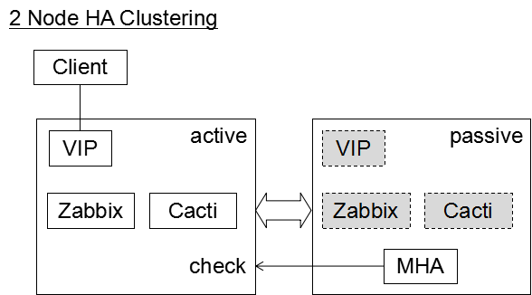
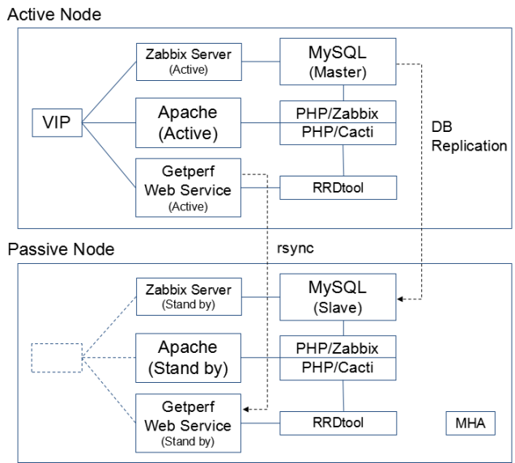

監視サーバのHA化
=============================

以下の要件を満たすように、監視サーバのHA化をします。

- 夜間、休日中のHW障害を対処するため、HA構成を組み、フェイルオーバーを自動化する。
- 障害発生時は監視機能の復旧を優先する。
- 障害発生中データロスの発生は許容するが、最小限にとどめるようにする。
- データの保護はディスクのミラーリングやバックアップなど別の仕組みで実現する。
- 既存の監視サーバ構成をベースにし、新たに待機系ノードの追加によりHA構成を組めるようにする。

システム構成
-----------------------------

監視サーバのHA構成を下図に記します。

- 1対1の稼働・待機の構成となり、監視対象との接続はVIP(仮想IP)の切り替えで制御します。
- クラスタリングソフト `MHA <https://code.google.com/p/mysql-master-ha/>`_ を使用し、稼働系のフェイルオーバー操作を自動化します。
- MHAは MySQL のクラスタリングソフトとなりますが、拡張スクリプトの拡張により、Zabbix,Cacti インスタンスを合せて系切替を制御します。

用途を Zabbix、Cacti　の2つに分け、稼働系2ノード、待機系2ノードの4ノード構成でも実装可能です。
目安として2ノード構成の場合は、100台までの監視対象をサポートし、4ノード構成の場合は、500台までの監視対象をサポートします。

.. note::

   - 稼働系の障害が発生時のフェイルオーバー処理の自動化のみをサポートします。
   - 待機系の障害発生時、フェイルオーバー実行後の切り戻し作業は手動で行う必要があります。
   - HA化により追加された構成要素に対しての監視仕様を定義し、別途、監視が必要になります。詳細はHA環境の監視設定を参照してください。

構成要素
-----------------------------

HA構成の構成要素は下図になります。

- Zabbix Server

   ZabbixはSNMP統計の情報採取など能動的な動作をするため、クラスター内で排他的に動作する様、制御が必要になります。
   待機系のZabbixはコールドスタンバイ構成として、インスタンスは停止させておきます。
   フェイルオーバー実行時に旧稼働系を停止し、待機系を起動します。

- MySQL

   MySQLレプリケーションを用いて、マスター、スレーブ構成のDBレプリケーション構成を組み、データを二重化します。
   稼働系のフェイルオーバー時はスレーブをマスターに昇格します。
   フェイルオーバー後の復旧は切り戻し作業が必要となり、手動でDBレプリケーション構成を再構成する必要があります。
   詳細は切り戻し手順を参照して下さい。

- Apache(PHP)

   Apache は受動的な動作となるため、ホットスタンバイ構成としてインスタンスは両ノードで起動させておき、VIP の付け替えでサービスを切り替えます。
   クライアントは VIP を宛先として接続します。

- Getperf Webサービス

   Apache と同様に、受動的な動作となるため、待機系の Web Service はホットスタンバイ構成にします。

- RRDtool

   時系列データベース RRDtool はクラスタリング機能をサポートしておらず、各ノードのローカルディスクにデータを蓄積します。
   本制約のため、稼働系を特定ノードに固定し、フェイルオーバー後は切り戻しをする運用とします。
   障害発生期間中は、データの欠落が発生します。

- MHA

   待機系ノードに MHA モニタリングサービスを起動し、各ノードの監視をします。
   MHA は稼働ノードの障害(Ping応答とMySQL接続応答なし)を検知した場合、自動でフェイルオーバーを実行し、VIPの付け替え、MySQLスレーブからマスターへの昇格、各構成要素のインスタンスの起動／停止を行います。
   フェイルオーバー実行後、MHA モニタリングサービスは終了します。監視の再開には、切り戻し作業を実行後、MHA モニタリングサービスの再起動を行う必要が有ります。

その他構成要素として、監視サーバ内でGetperfエージェントにてリモート採取の設定をした場合、Zabbixと同様に排他制御が必要になります。
エージェントの設定ファイルで稼働ノードのチェックを追加し、稼働系のみで情報採取を実行するように制御します。

各要素のHA動作をまとめると下表となります。

.. list-table::
   :widths: 25 30 45
   :header-rows: 1

   * - 構成要素
     - HA構成時の動作
     - フェイルオーバー時処理
   * - Zabbix Server
     - 稼働系のみ起動
     - MHAでインスタンスの起動/停止を制御
   * - MySQL
     - DBレプリケーションでデータを二重化
     - MHAでスレーブの昇格
   * - Apache(PHP)
     - 両系で起動
     - VIPの付け替え
   * - Getperf Webサービス
     - 両系で起動
     - VIPの付け替え
   * - RRDtool
     - 何もしない
     - 何もしないため、データロス発生

HA導入手順
-----------------------------

`MHA <https://code.google.com/p/mysql-master-ha/>`_ を用いたHAクラスター導入手順を記します。
ここでは、2ノード構成でのHAクラスター導入手順を記します。本手順は以下のサーバ構成情報を基にしています。
IPアドレスは適宜環境に合わせて変更してください。

.. list-table:: 
   :widths: 33 33 33
   :header-rows: 1

   * - 項目
     - 稼働系
     - 待機系
   * - 仮想IP(VIP)
     - 192.168.10.10(eth0:1)
     - 同左
   * - 物理IP
     - 192.168.10.1(eth0)
     - 192.168.10.2(eth0)
   * - HAソフト構成
     - MHA node
     - MHA node+manager
   * - MySQL構成
     - MySQL マスター
     - MySQL スレーブ
   * - HAサービス定義
     - Zabbix, Apache, Getperf
     - 同左

導入ステップは以下となります。

1. 各ノードにVIPを追加し、VIP経由でサービスが動作する様に構成変更する

   各ノードでVIPを追加し、VIP経由で各サービスの動作を確認します。

   - Getperf Webサービスとエージェント
   - Zabbix サーバとエージェント
   - Apache HTTPサーバ(Zabbix, Cacti)

2. HAクラスター化と動作確認

   各ノードをHAクラスター化します。

   - MySQLのレプリケーション設定
   - HAクラスター構成のセットアップと、フェイルオーバーの動作を確認

3. HAクラスターの監視設定

   HAクラスター構成の監視設定をします。クラスター外部のZabbixサーバから各ノードの監視設定をします。

各ノードのVIP追加、サービスの構成変更
^^^^^^^^^^^^^^^^^^^^

**稼働系のVIP追加**

稼働系でVIPを追加し、ARPテーブルを更新します。

::

   sudo /sbin/ifconfig eth0:1 192.168.10.10 netmask 255.255.255.0 up
   sudo /sbin/arping -q -A -I eth0 -c 1 192.168.10.10

**Getperf Webサービスの VIP 変更**

Getperf Webサービスを VIP に変更します。

::

   vi $GETPERF_HOME/config/getperf_site.json

以下の行のIPアドレスをVIPに変更します。

::

   "GETPERF_WS_SERVER_NAME": "192.168.10.10",
   "GETPERF_WS_ADMIN_SERVER":   "192.168.10.10",
   "GETPERF_WS_DATA_SERVER":    "192.168.10.10",

サーバ証明書を更新、Getperf Webサービス用の Apache HTTP サーバ設定の更新をします。

::

   cd $GETPERF_HOME
   rex server_cert      # サーバ証明書構成
   rex prepare_apache   # Apache HTTP サーバ設定更新

Getperf Webサービスを再起動します。

::

   rex restart_ws_admin
   rex restart_ws_data

WebブラウザからVIP経由でAxis2管理コンソールの接続確認をします。

::

   http://192.168.10.10:57000/axis2/
   http://192.168.10.10:58000/axis2/

**GetperfエージェントのVIP変更**

Getperfエージェントの設定をVIPに変更します。

.. note:: 監視サーバ上でGetperfエージェントにてリモート採取をしている場合に実行してください。

::

   vi ~/ptune/network/getperf_ws.ini

以下の行のIPアドレスをVIPに変更します。

::

   URL_CM = https://192.168.10.10:57443/axis2/services/GetperfService
   URL_PM = https://192.168.10.10:58443/axis2/services/GetperfService

Getperf エージェントを再起動します。

::

   ~/ptune/bin/getperfctl stop
   ~/ptune/bin/getperfctl start

**Zabbix 設定のVIP変更**

次に、Zabbix 設定をVIPに変更します。

::

   vi $GETPERF_HOME/config/getperf_zabbix.json

以下の行のIPアドレスをVIPに変更します。

::

   "ZABBIX_SERVER_IP":          "192.168.10.10",

Zabbix 本体の設定ファイルにVIP設定を追加します。

::

   sudo vi /etc/zabbix/zabbix_server.conf

以下の行をVIPに変更して追加します。

::

   SourceIP=192.168.10.10

Zabbix サーバを再起動します。

::

   sudo /etc/init.d/zabbix-server restart

以下のURLで、WebブラウザからVIP経由で接続できることを確認します。

::

   http://192.168.10.10/zabbix/

**Zabbix エージェントのVIP変更**

Zabbix エージェントの設定をVIPを変更します。

::

   vi ~/ptune/zabbix_agentd.conf

以下の行のIPアドレスをVIPに変更します。

::

   <最終行>
   Server=192.168.10.10
   ServerActive=192.168.10.10

Zabbix エージェントを再起動します。

::

   sudo /etc/init.d/zabbixagent restart

**待機系のVIP追加**

稼働系と同様の手順で待機系で以下のVIPの設定変更をします。

- Getperf WebサービスのVIP設定変更
- Getperf エージェントの設定のVIP変更
- ZabbixサーバのVIP設定変更
- Zabbix エージェントの設定のVIP設定変更

各ノードのHAクラスター化
^^^^^^^^^^^^^

**root の ssh 公開鍵の配布**

MHA のリモート操作用にノード間で root の ssh 接続許可設定をします。
稼働系、待機系の順で各ノードに ssh 公開鍵の配布をします。

::

   sudo ssh-keygen -t rsa -f /root/.ssh/id_rsa -q -N ""
   sudo ssh-copy-id -i /root/.ssh/id_rsa.pub root@192.168.10.1
   sudo ssh-copy-id -i /root/.ssh/id_rsa.pub root@192.168.10.2

**MySQL 監視用のユーザ作成**

MySQL Ping監視用ユーザを作成します。稼働系、待機系の順で実行します。

::

   mysql -u root -p

MySQL コンソールから監視用ユーザ mha と、レプリケーション用ユーザ repl を作成します。

::

   grant all privileges on *.* to mha@'%' identified by 'mha';
   grant replication slave on *.* to repl@'%' identified by 'repl';
   grant all privileges on *.* to repl with grant option;
   flush privileges;
   exit

**MySQL 設定ファイル編集**

MySQL 設定ファイルにレプリケーション設定を追加します。稼働系、待機系の順で実行します。

::

   sudo vi /etc/my.cnf

先頭行に以下を追加します。server-id は、稼働系を 101、待機系を 102　にしてください。

::

   [mysqld]
   #バイナリログの出力
   log-bin=mysqld-bin
   #server-idは一意になるように設定する
   # 101:稼働系, 102:待機系
   server-id=101
   # バイナリログ保存期間
   expire_logs_days = 7

設定を反映するため、 mysqld を再起動します。

::

   sudo /etc/init.d/mysqld restart

**稼働系MySQLデータのバックアップ**

稼働系でMySQLデータのバックアップをします。稼働系でMySQLに接続します。

::

   mysql -u root -p

バックアップ対象のデータ容量を確認します。
バックアップ時間はデータ容量に依存します。
データ容量からバックアップ時間の目安を確認します。

::

   select table_schema, sum(data_length+index_length) /1024 /1024 as MB 
   from information_schema.tables where table_schema = "zabbix";

.. note::

   既に稼働中の監視サーバでレプリケーションを構成する場合、MySQLの蓄積データが大きいと、
   バックアップ処理で長時間待たされる場合が有ります。
   MySQL 標準のバックアップコマンド mysqldump は実行中にDB全体にロックを掛ける為、その間の監視運用に影響が生じる場合が有ります。
   本制約の回避が必要な場合は、Percona社 XtraBackup などのオンラインバックアップツールを使用して下さい。
   XtraBackup のバックアップについては次のセクションで手順を記します。

全テーブルをロックします。

::

   flush tables with read lock;

バイナリログのステータスを表示します。

::

   show master status;

待機系のスレーブ設定で、File, Position を使用するので値を控えておきます。

::

   +-------------------+----------+--------------+------------------+
   | File              | Position | Binlog_Do_DB | Binlog_Ignore_DB |
   +-------------------+----------+--------------+------------------+
   | mysqld-bin.000002 |      107 |              |                  |
   +-------------------+----------+--------------+------------------+

上記端末は残したまま、別端末を追加で開き、ダンプを実行します。

::

   mysqldump -u root -p --all-databases --lock-all-tables --events \
   > mysql_dump.sql

元の端末に戻って、ロックを解除します。

::

   unlock tables;
   exit;

ダンプファイルを稼働系から待機系にコピーします。

::

   scp mysql_dump.sql 192.168.10.2:/tmp/

**MySQLバックアップデータのリストア**

稼働系から転送したダンプデータをインポートします。

::

   mysql -u root -p < /tmp/mysql_dump.sql

**XtraBackupでのデータバックアップ**

yumでインストールします。
稼働系、待機系の両方で必要になりますので順にインストールします。

::

   sudo -E rpm -Uhv http://www.percona.com/downloads/percona-release/percona-release-0.0-1.x86_64.rpm
   sudo -E yum install xtrabackup

任意の場所にバックアップを取得します。ここでは、/backup/xtrabackup/の下にバックアップします。

::

   sudo mkdir -p /backup/xtrabackup/
   sudo time innobackupex --user root --password mysql_password \
   /backup/xtrabackup/

completed OK!が出れば完了です。
メッセージにbinlogのファイル名とpositionも出力されますのでfilenameとpositionの値を控えておきます。

::

   innobackupex: MySQL binlog position: filename 'mysqld-bin.000001', position 310

バックアップ処理中の更新ログを適用します。
--apply-logオプションは、全コマンドで実行したバックアップディレクトリを指定します。

::

   sudo innobackupex --user root --password mysql_password \
   --apply-log /backup/xtrabackup/2016-08-28_11-15-12

バックアップディレクトリをアーカイブし、待機系にコピーします。

::

   cd /backup/
   tar cvf - xtrabackup/2016-08-28_11-15-12 | gzip > backup.tar.gz
   scp  backup.tar.gz root@192.168.10.2:/tmp/

**XtraBackupの場合のリストア**

XtraBackupを使用した場合の待機系リストア手順は以下の通りです。

.. note:: 以下のリストア作業はすべて、rootで実行してください。

MySQLを停止し、データディレクトリを退避して新たにデータディレクトリを作成します。

::

   /etc/init.d/mysqld stop
   mv /var/lib/mysql /var/lib/mysql.old
   mkdir /var/lib/mysql

バックアップファイルを解凍し、解凍してできたディレクトリを指定して、リストアを実行します。

::

   cd /tmp/
   tar xvf backup.tar.gz
   time innobackupex --copy-back /tmp/xtrabackup/2016-08-28_11-15-12

ディレクトリの権限をmysqlに変更してMySQLをスタートします。

::

   chown -R mysql:mysql /var/lib/mysql
   /etc/init.d/mysqld start

**MySQLレプリケーション設定**

待機系で、MySQLレプリケーションのスレーブ設定をします。
MySQLコンソールに接続し、MySQL レプリケーションのスレーブ設定をします。

::

   mysql -u root -p

change master to コマンドでレプリケーションの開始位置を指定します。
稼働系で確認した、バイナリログの File, Position を指定します。

::

   change master to
        master_host='192.168.10.1',    # マスターサーバーのIP
        master_user='repl',           # レプリケーション用ID
        master_password='repl',       # レプリケーション用IDのパスワード
        master_log_file='mysqld-bin.000002',    # マスターサーバーで確認した File 値
        master_log_pos=107;    # マスターサーバーで確認した Position 値

レプリケーションを開始します。

::

   start slave;

ステータスを確認します。

::

   show slave status \G

上記結果で、Slave_IO_Running と Slave_SQL_Running が Yes
となり、Last_Error　にエラーメッセージが出力がされていなければOKです。

**MySQLレプリケーション　動作確認**

単純なDB更新作業で、レプリケーションの動作を確認します。
上記で特にエラーなど問題が発生していない場合は、省略しても構いません。

稼働系でテスト用のデータベースを作成します。

::

   mysql -u root -p -e 'create database test_db;'
   mysql -u root -p -e 'show databases;'

待機系でデータベースが作成されていることを確認します。

::

   mysql -u root -p -e 'show databases;'

確認できたら、稼働系で作成したテスト用データベースを削除します。

::

   mysql -u root -p -e 'drop database test_db;'

**MHAインストール**

稼働系、待機系の順に実施します。
`MHA ダウンロードサイト <https://code.google.com/p/mysql-master-ha/wiki/Downloads?tm=2>`_ から最新版のモジュールをダウンロードします。ここでは以下モジュールをダウンロードします。

- MHA Manager 0.56 rpm RHEL6
- MHA Node 0.56 rpm RHEL6

稼働系で MHA Node をインストールします。

::

   sudo -E yum localinstall -y mha4mysql-node-0.56-0.el6.noarch.rpm

待機系で MHA Node と、MHA Manager をインストールします。

::

   sudo -E yum localinstall -y mha4mysql-node-0.56-0.el6.noarch.rpm
   sudo -E yum localinstall -y mha4mysql-manager-0.56-0.el6.noarch.rpm

**MHA拡張スクリプト配布**

待機系でMHA拡張スクリプトを配布します。配布するスクリプトは以下の2種です。

- master_ip_failover

   フェイルオーバー実行時の系切換え拡張スクリプト。MHA のソースコードに添付されたサンプルをベースに以下の機能を追加。

   - VIPの付け替え
   - Zabbixサーバの起動／停止
   - ptuneエージェントの再起動

- master_ip_online_change

   手動でスイッチオーバーをする際の系切替拡張スクリプト。master_ip_failoverと同様の機能を追加。

以下ディレクトリからスクリプトをコピーします。

::

   sudo -E cp $GETPERF_HOME/script/template/mha/master_ip_failover \
   /usr/bin/
   sudo -E chmod 755 /usr/bin/master_ip_failover
   sudo -E cp $GETPERF_HOME/script/template/mha/master_ip_online_change \
   /usr/bin/
   sudo -E chmod 755 /usr/bin/master_ip_online_change

**MHA設定ファイルの編集**

待機系で MHA 設定ファイル /etc/mha.conf を作成します。
$GETPERF_HOME/script/template/mha/ の下の、サンプル mha.conf.sample を参考に設定ファイルを編集してください。

::

   sudo cp $GETPERF_HOME/script/template/mha/mha.conf.sample /etc/mha.conf
   sudo vi /etc/mha.conf

IPアドレスとネットワークデバイスの箇所を環境に合わせて変更します。
編集後、以下のコマンドでMHAの動作確認をします。

::

   sudo masterha_check_ssh --conf=/etc/mha.conf    # ssh 疎通確認
   sudo masterha_check_repl --conf=/etc/mha.conf   # MySQL 疎通確認

**MHAデーモンの常駐化**

待機系でMHAデーモンの常駐設定をします。
起動設定は CentOSで標準インストールされている `upstart <http://upstart.ubuntu.com/>`_ を使用します。

::

   sudo vi /etc/init/mha.conf

::

   description     "MasterHA manager services"

   chdir /var/log/masterha
   exec /usr/bin/masterha_manager --conf=/etc/mha.conf >> /var/log/masterha/masterha_manager.log 2>&1
   pre-start exec /usr/bin/masterha_check_repl --conf=/etc/mha.conf
   post-stop exec /usr/bin/masterha_stop --conf=/etc/mha.conf

設定を反映します。

::

   sudo initctl reload-configuration
   sudo initctl list | grep mha

MHAログディレクトリを作成します。

::

   sudo mkdir /var/log/masterha

MHAデーモンを起動します。

::

   sudo initctl start mha

起動を確認します。

::

   initctl list | grep mha
   ps auxf | grep mha
   sudo tail -f /var/log/masterha/masterha_manager.log

.. note:: 停止するときは、以下のコマンドを実行します。

   ::

      sudo initctl stop mha

**フェイルオーバーテスト**

ここでは、簡単に稼働系でMySQLをkillしてフェイルオーバー動作を確認します。
待機系でMHAログを確認します。

::

   sudo tail -f /var/log/masterha/masterha_manager.log

別端末で稼働系を開き、MySQL を kill します。

::

   sudo pkill mysql

フェイルオーバー後以下手順でサービスが引き継がれていることを確認します。

- MHAログからフェイルオーバーが処理されていること
- WebブラウザからVIPで Zabbix、Cacti のコンソールに接続できること
   - http://192.168.10.10/zabbix/
   - http://192.168.10.10/{サイトキー}/
- Getperf WebサービスのAxis2コンソールに接続できること
   - http://192.168.10.10:57000/axis2/
   - http://192.168.10.10:57000/axis2/
- 現稼働系(旧待機系)でZabbix サーバが起動されていること。以下のログから確認する
   - /var/log/zabbix/zabbix_server.log
- 現稼働系でMySQLが稼働されていること。以下のコマンドで確認する

   ::

      sudo masterha_check_ssh  --conf=/etc/mha.conf
      sudo masterha_check_repl --conf=/etc/mha.conf

フェイルオーバー後の切り戻し
^^^^^^^^^^^^^^

フェイルオーバー発生後は、手動で旧稼働系を復帰させ、切り戻し作業を行います。
その手順を以下に記します。前提条件として、フェールオーバー後の旧稼働系は以下の状態となっていることとします。

- 旧稼働系でOSが起動ができる状態にする。
- 以下のサービスは停止した状態にする。
   - MySQL
   - Zabbix Server

**旧稼働系をスレーブとして復帰**

新稼働系でバイナリログチェックポイントを確認します。

::

   mysql -u root -p -e "show master status;"
   +-------------------+-----------+--------------+------------------+
   | File              | Position  | Binlog_Do_DB | Binlog_Ignore_DB |
   +-------------------+-----------+--------------+------------------+
   | mysqld-bin.000001 | 620812883 |              |                  |
   +-------------------+-----------+--------------+------------------+

旧稼働系をMySQLスレーブとして設定します。MySQLがダウンしている場合は起動します。

::

   sudo /etc/init.d/mysqld start

旧稼働系のMySQLに接続して、レプリケーション設定をします。

::

   mysql -u root -p

::

   SET GLOBAL read_only = 1;
   SET GLOBAL sql_slave_skip_counter = 1;
   change master to
       master_host='192.168.10.2',
       master_user='repl',
       master_password='repl',
       master_log_file='mysqld-bin.000001',
       master_log_pos=620812883;
   start slave;
   show slave status;
   exit;

旧待機系でMHAチェックコマンドを実行して、sshとレプリケーションの状態確認をします。

::

   sudo masterha_check_ssh --conf=/etc/mha.conf
   sudo masterha_check_repl --conf=/etc/mha.conf

**系の切り戻し**

旧待機系で切り戻しを実行します。
フェイルオーバー後に生成されるフラグファイルを削除します。

::

   sudo rm -f /tmp/mha/mha.failover.complete

手動切り戻しスクリプトを実行します。IPアドレスは旧稼働系のIPアドレスを指定します。

::

   sudo masterha_master_switch --master_state=alive \
   --conf=/etc/mha.conf \
   --new_master_host=192.168.10.1  --orig_master_is_new_slave

旧稼働系でデーモンを再起動します。

::

   sudo initctl start mha

元に戻っていることを確認します。

::

   sudo masterha_check_repl --conf=/etc/mha.conf

.. note:: スレーブで不整合エラーが出る場合の対処

   "show slave status;"で更新SQLのエラーが発生した場合は、以下のコマンドでエラーとなったSQLを順にスキップさせてください。

   ::

      mysql -u root -p
      STOP SLAVE; SET GLOBAL SQL_SLAVE_SKIP_COUNTER=1; START SLAVE;
      show slave status;

サマリ
-----------------------------

本セクションでは監視サーバのHA化セットアップ手順を記しました。
HA化環境で以下の運用をすることで、より高いサーバの可用性、データの保全性の維持が可能となります。
次節でこれらを説明します。

1. 監視サーバの監視

   監視サーバの監視手順を次節で説明します

2. 監視サーバのバックアップ

   監視サーバの蓄積データのバックアップ手順を次節で説明します

2. フェイルオーバー時の切り戻し作業

   フェールオーバー発生時の切り戻し手順となり、前節の「フェイルオーバー後の切り戻し」をします

